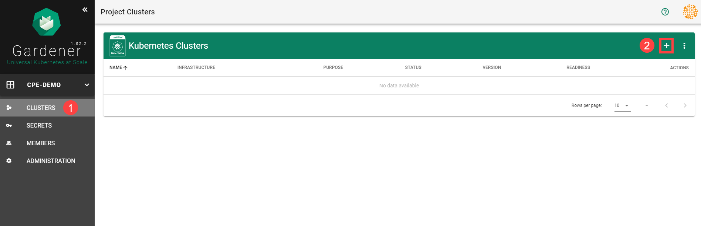
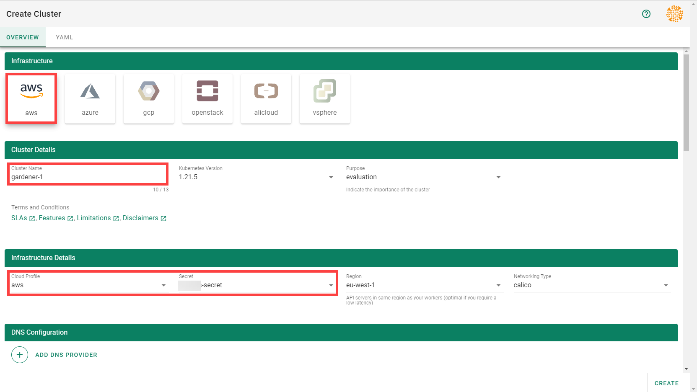
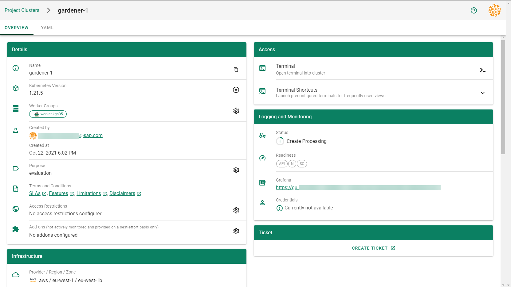
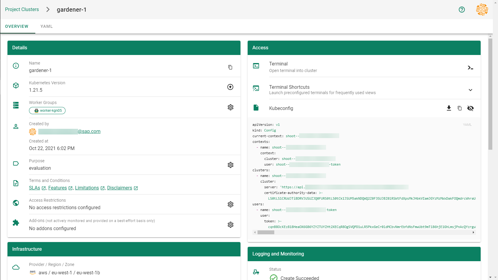

### Overview

Gardener allows you to create a Kubernetes cluster on different infrastructure providers. This tutorial will guide you through the process of creating a cluster on AWS.

### Prerequisites

- You need an [AWS account](https://aws.amazon.com/).
- You have access to the Gardener dashboard and have permissions to create projects.

### Steps

1. Go to the Gardener dashboard and create a *Project*.

    

1. Choose *Secrets*, then the plus icon  and select *AWS*.

    

1. To copy the policy for AWS from the Gardener dashboard, click on the help icon  for AWS secrets, and choose copy .

    

1. To [create a new policy](https://console.aws.amazon.com/iam/home?#/policies) in AWS:
    1. Choose *Create policy*.
        
        
    
    1. Paste the policy that you copied from the Gardener dashboard to this custom policy.

        

    1. Choose *Next* until you reach the Review section.

    1. Fill in the name and description, then choose *Create policy*.

        
        

1. [Create a new technical user](https://console.aws.amazon.com/iam/home?#/users$new?step=details).
    1. Type in a username and select the access key credential type.

        

    1. Choose *Attach an existing policy*.
    1. Select *GardenerAccess* from the policy list.
    1. Choose *Next* until you reach the Review section.

    

    

     > Note: After the user is created, `Access key ID` and `Secret access key` are generated and displayed. Remember to save them. The `Access key ID` is used later to create secrets for Gardener.

    

1. On the Gardener dashboard, choose *Secrets* and then the plus sign . Select *AWS* from the drop down menu to add a new AWS secret.

1. Create your secret.

    1. Type the name of your secret.
    1. Copy and paste the `Access Key ID` and `Secret Access Key` you saved when you created the technical user on AWS.
    3. Choose *Add secret*.
    

    >After completing these steps, you should see your newly created secret in the *Infrastructure Secrets* section.

    

1. To create a new cluster, choose *Clusters* and then the plus sign in the upper right corner.

    

1. In the *Create Cluster* section:
    1. Select *AWS* in the *Infrastructure* tab.
    1. Type the name of your cluster in the *Cluster Details* tab.
    1. Choose the secret you created before in the *Infrastructure Details* tab.
    1. Choose *Create*.

    

1. Wait for your cluster to get created.

    

### Result

After completing the steps in this tutorial, you will be able to see and download the kubeconfig of your cluster.

  