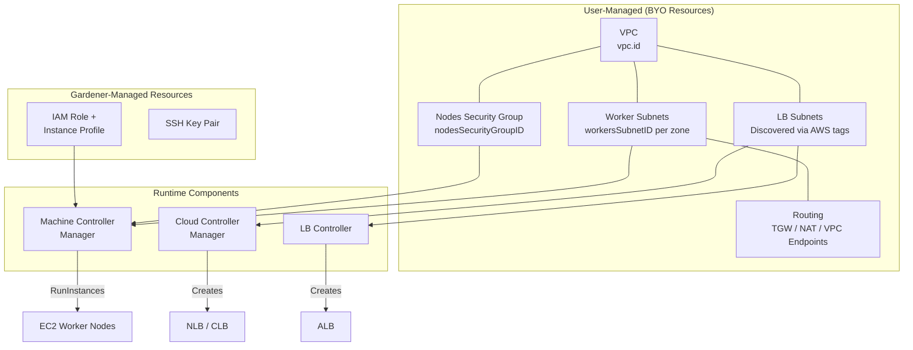
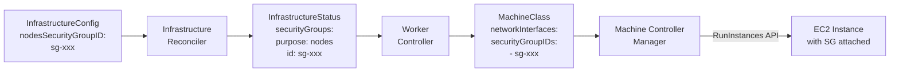
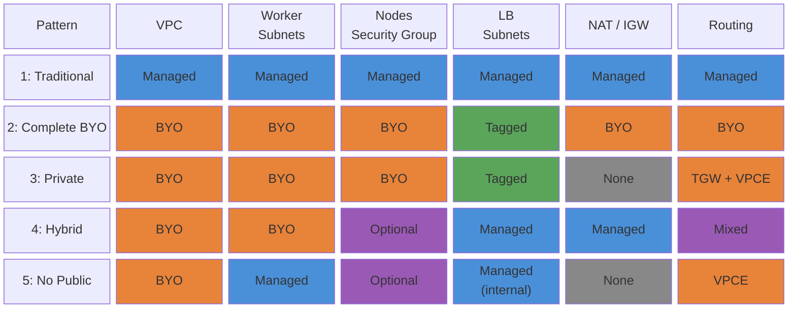
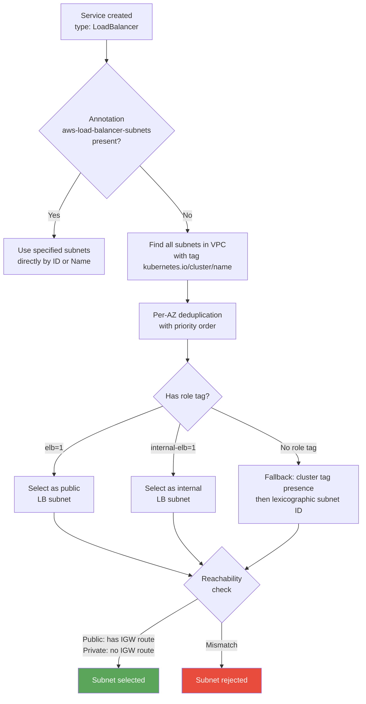
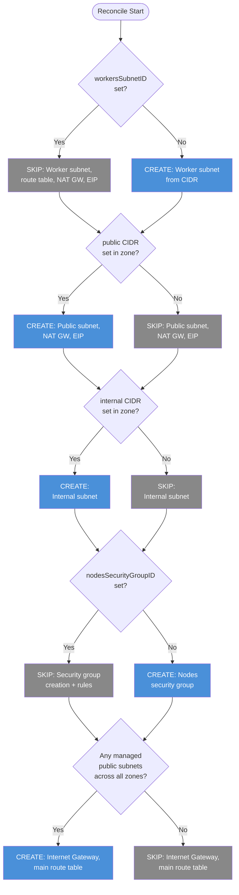

# Bring Your Own Infrastructure (BYOI) - Flexible Network Configuration

## Summary

This proposal enables users to deploy Gardener-managed Kubernetes clusters into pre-provisioned AWS infrastructure. Users can bring their own:

1. **VPC** (already supported via `vpc.id`)
2. **Worker subnets** - existing subnets for EC2 node placement
3. **Security groups** - existing nodes security group with corporate-compliant rules
4. **Routing** - Transit Gateway, centralized NAT, VPC endpoints, or any custom topology
5. **Load balancer subnets** - discovered automatically via standard AWS tags (no explicit IDs needed)

The design principle is: **BYO resources are referenced, never created, modified, or deleted by Gardener.**

### Resource Ownership Overview



## Motivation

Enterprise organizations need to:

- **Reuse centrally-managed network infrastructure** (shared VPCs, hub-and-spoke topologies)
- **Comply with security policies** requiring pre-approved security groups and firewall rules
- **Deploy private clusters** using VPC endpoints or Transit Gateway (no Internet Gateway)
- **Optimize costs** through shared NAT gateways or centralized egress
- **Integrate with EKS-like architectures** where subnets, security groups, and routing are pre-provisioned by a platform team

Today, Gardener always creates subnets, security groups, NAT gateways, and route tables. This prevents integration with existing network infrastructure.

## Design Rationale: Why No Explicit LB Subnet IDs

A key design decision is that **internal and public load balancer subnets are NOT referenced by ID**. Instead, they are discovered at runtime via standard AWS tags by the Cloud Controller Manager (CCM) and AWS Load Balancer Controller (LBC). This is because:

1. **The CCM and LBC already discover subnets via tags** - this is the standard AWS Kubernetes pattern (same as EKS). The tags `kubernetes.io/role/internal-elb=1` and `kubernetes.io/role/elb=1` are the authoritative mechanism.

2. **Gardener itself never uses internal/public subnet IDs** - analysis of the codebase shows:
   - `PurposeInternal` is a dead constant: never produced, never consumed
   - `PurposePublic` is consumed only for the CCM config's `SubnetID` field (a fallback identity, not for LB placement) - and we can use the workers subnet for that instead

3. **Users must tag subnets anyway** - even if we accepted subnet IDs, the CCM/LBC would still require the tags. Accepting IDs would create a false sense that tagging isn't needed.

4. **Users can override per-Service** via the `service.beta.kubernetes.io/aws-load-balancer-subnets` annotation if they need explicit control.

## Design Rationale: Why Security Group ID IS Explicit

Unlike LB subnets, the nodes security group **must** be explicitly specified via `nodesSecurityGroupID` when bringing your own infrastructure. This is because:

1. **Chicken-and-egg problem**: The security group ID must be known at MachineClass creation time, before any EC2 instances exist. You can't discover a SG from instances that don't exist yet.

2. **MCM is the sole consumer**: The security group flows from `InfrastructureStatus` → Worker controller → `MachineClass.providerSpec.networkInterfaces[].securityGroupIDs` → MCM → `RunInstances` API. It is attached to the EC2 instance's primary network interface at launch.

3. **The CCM does NOT need the SG**: Gardener configures `DisableSecurityGroupIngress=true` in the CCM's cloud-provider-config, which tells it to skip all security group rule management for load balancers.

4. **No standard tag convention exists**: Unlike subnets (which have well-defined `kubernetes.io/role/*` tags), there is no standard tag for "this is the nodes security group." EKS also requires explicit SG specification for node groups.

5. **No auto-discovery mechanism**: The AWS API has no built-in way to identify "the security group meant for Kubernetes nodes" without either tags or explicit configuration.

### Security Group Data Flow



## API Changes

### Zone Structure

One new optional field allows referencing an existing worker subnet:

```go
type Zone struct {
    Name string

    // Gardener-managed subnet CIDRs (all optional when WorkersSubnetID is set)
    Workers  string  // +optional, mutually exclusive with WorkersSubnetID
    Internal string  // +optional
    Public   string  // +optional

    // BYO worker subnet
    WorkersSubnetID *string  // +optional, mutually exclusive with Workers

    // Only valid when Workers and Public CIDRs are set (Gardener-managed)
    ElasticIPAllocationID *string  // +optional
}
```

### Networks Structure

One new optional field allows referencing an existing security group:

```go
type Networks struct {
    VPC   VPC
    Zones []Zone

    // NodesSecurityGroupID optionally specifies an existing security group for worker nodes.
    // When provided, Gardener will not create a nodes security group.
    // Requires VPC.ID to be set.
    // +optional
    NodesSecurityGroupID *string
}
```

## Validation Rules

| Field | Rule |
|-------|------|
| `workers` / `workersSubnetID` | **Exactly one** must be provided per zone (XOR) |
| **Zone consistency** | **All zones must use the same approach**: either all `workersSubnetID` or all `workers` CIDR. Mixing is forbidden. |
| `internal` | Optional. When omitted, no internal subnet is created; LB subnets discovered via tags |
| `public` | Optional. When omitted, no public subnet/NAT gateway is created; LB subnets discovered via tags |
| `elasticIPAllocationID` | Only valid when both `workers` AND `public` CIDRs are set |
| `workersSubnetID` | Requires `VPC.ID` to be set. Must exist in correct VPC/AZ. Immutable. |
| `nodesSecurityGroupID` | Requires `VPC.ID` to be set. Must exist in correct VPC. Immutable. |

Switching from CIDR-based to SubnetID-based workers (or vice versa) is **forbidden** on update.

### Why No Mixed BYO/Managed Zones

Mixed setups (some zones with `workersSubnetID`, others with `workers` CIDR) are forbidden because:
- Gardener-managed zones require an Internet Gateway for public subnets and NAT gateways
- BYO zones typically operate without an Internet Gateway (Transit Gateway, VPC endpoints)
- The conflicting infrastructure requirements would create an inconsistent and confusing network topology

## Configuration Patterns

### Patterns at a Glance



> Legend: Blue = Gardener-managed | Orange = User-provided (BYO) | Green = Tag-discovered | Purple = Optional | Gray = Not applicable

### Pattern 1: Traditional Gardener (Unchanged)

```yaml
networks:
  vpc:
    cidr: 10.250.0.0/16
  zones:
    - name: eu-west-1a
      workers: 10.250.0.0/19
      internal: 10.250.32.0/20
      public: 10.250.48.0/20
```

### Pattern 2: Complete BYO Infrastructure

User provides VPC, worker subnets, and security group. LB subnets are discovered via tags.

```yaml
networks:
  vpc:
    id: vpc-abc123
  nodesSecurityGroupID: sg-0123456789abcdef0
  zones:
    - name: eu-west-1a
      workersSubnetID: subnet-workers-1a
    - name: eu-west-1b
      workersSubnetID: subnet-workers-1b
```

**What Gardener creates:** IAM role, instance profile, SSH key pair only.

**User responsibilities:**
- Worker subnet routing (NAT/Transit Gateway/VPC endpoints for connectivity)
- Internal LB subnets tagged with `kubernetes.io/role/internal-elb=1` and `kubernetes.io/cluster/<name>=shared`
- Public LB subnets tagged with `kubernetes.io/role/elb=1` and `kubernetes.io/cluster/<name>=shared`
- Security group with appropriate rules (see below)
- Minimum 8 available IPs per LB subnet; at least 2 AZs for ALBs

### Pattern 3: Private Cluster (No IGW, Transit Gateway)

```yaml
networks:
  vpc:
    id: vpc-private
    gatewayEndpoints:
      - s3
      - dynamodb
  nodesSecurityGroupID: sg-private-nodes
  zones:
    - name: eu-west-1a
      workersSubnetID: subnet-private-workers-1a
    - name: eu-west-1b
      workersSubnetID: subnet-private-workers-1b
```

No Internet Gateway required. Connectivity via Transit Gateway + VPC endpoints.

### Pattern 4: BYO Workers, Gardener-Managed LB Subnets

```yaml
networks:
  vpc:
    id: vpc-abc123
  zones:
    - name: eu-west-1a
      workersSubnetID: subnet-existing-workers
      internal: 10.250.32.0/20
      public: 10.250.48.0/20
```

Gardener creates internal/public subnets and NAT gateway. User manages worker subnet routing.

### Pattern 5: Gardener Workers, No Public Subnet (VPC Endpoints Only)

```yaml
networks:
  vpc:
    id: vpc-private
    gatewayEndpoints:
      - s3
      - dynamodb
  zones:
    - name: eu-west-1a
      workers: 10.250.0.0/19
      internal: 10.250.32.0/20
      # No public subnet - no NAT gateway
```

## Load Balancer Subnet Discovery

The CCM and LBC discover subnets automatically using the following process (verified from cloud-provider-aws source):

### Discovery Flow

1. **Annotation override**: If `service.beta.kubernetes.io/aws-load-balancer-subnets` is set on the Service, those subnets are used directly (by ID or Name tag)
2. **Tag-based discovery**: Find all subnets in the VPC with cluster tag `kubernetes.io/cluster/<name>`
3. **Per-AZ deduplication** with priority:
   - Role tag: `kubernetes.io/role/elb=1` (public) or `kubernetes.io/role/internal-elb=1` (internal)
   - Cluster tag presence
   - Lexicographic subnet ID order
4. **Reachability check**: Public LB subnets must have an IGW route; private subnets must not



### Required Tags on User-Provided LB Subnets

**Internal Load Balancers:**
```
kubernetes.io/role/internal-elb = 1
kubernetes.io/cluster/<cluster-name> = shared
```

**Public Load Balancers:**
```
kubernetes.io/role/elb = 1
kubernetes.io/cluster/<cluster-name> = shared
```

### Requirements

- ALBs: at least 2 subnets across different AZs
- NLBs: can use a single subnet
- Each LB subnet: minimum 8 available IP addresses
- Public subnets: must have route to Internet Gateway
- Private subnets: must NOT have route to Internet Gateway

## Security Group Requirements for BYO

When providing `nodesSecurityGroupID`, the security group **must** have:

| Direction | Protocol | Ports | Source/Dest | Purpose |
|-----------|----------|-------|-------------|---------|
| Ingress | All | All | Self (same SG) | Pod-to-pod, node-to-node |
| Ingress | TCP | 30000-32767 | 0.0.0.0/0 or LB CIDRs | NodePort services |
| Ingress | UDP | 30000-32767 | 0.0.0.0/0 or LB CIDRs | NodePort services |
| Egress | All | All | 0.0.0.0/0 | Outbound connectivity |

Additional rules for EFS (TCP 2049) if using CSI EFS driver.

## Implementation Approach

### Reconcile Flow Changes

| Condition | Skip |
|-----------|------|
| `workersSubnetID` set | Worker subnet creation, route table, NAT gateway, elastic IP |
| No `public` CIDR in zone | Public subnet, NAT gateway, elastic IP for that zone |
| No `internal` CIDR in zone | Internal subnet for that zone |
| `nodesSecurityGroupID` set | Nodes security group creation and rule management |
| No Gardener-managed public subnets anywhere | Main route table, Internet Gateway requirement |



### Delete Flow

BYO resources are **never deleted**:
- Worker subnets referenced by `workersSubnetID` are not deleted
- Security groups referenced by `nodesSecurityGroupID` are not deleted
- VPC referenced by `VPC.ID` is already not deleted (existing behavior)

### InfrastructureStatus

- `VPC.Subnets[purpose=nodes]`: reports BYO worker subnet ID (from `workersSubnetID`) or Gardener-created one
- `VPC.SecurityGroups[purpose=nodes]`: reports BYO security group ID or Gardener-created one
- CCM config: uses workers subnet as `SubnetID` fallback when no public subnet exists

## Open Questions

### Q: What about IPv6 support with BYO subnets?
**A:** If `workersSubnetID` is provided, the extension will discover the IPv6 CIDR block from the subnet/VPC via the AWS API.

### Q: Can users mix BYO and Gardener-managed workers across zones?
**A:** Yes, but not recommended. Operationally complex - we recommend consistency.

### Q: Is migration from Gardener-managed to BYO possible?
**A:** Not planned. `workersSubnetID` and `workers` are immutable; switching between them is forbidden.

## Success Criteria

- Users can deploy clusters with pre-provisioned VPC + worker subnets + security groups
- Users can deploy clusters without Internet Gateway or NAT gateways
- LB subnets are discovered via standard AWS tags (no explicit IDs needed)
- Zero breaking changes to existing clusters
- BYO resources are never modified or deleted by Gardener
