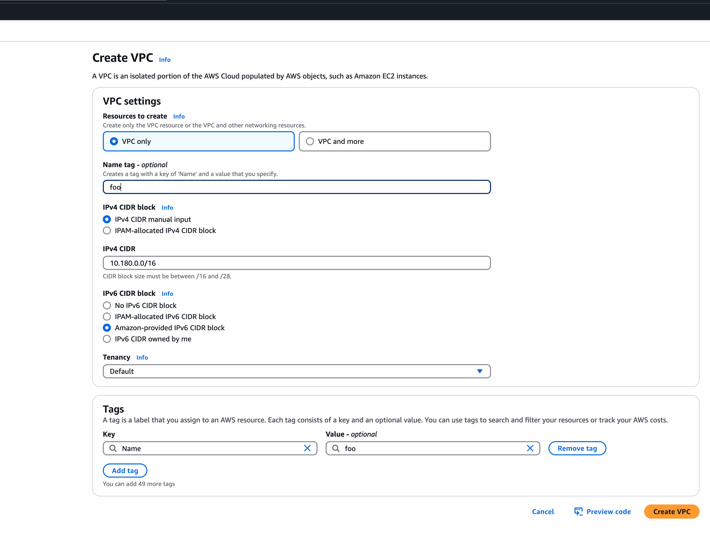

# Support for IPv6

## Overview

Gardener supports different levels of IPv6 support in shoot clusters.
This document describes the differences between them and what to consider when using them.

In [IPv6 Ingress for IPv4 Shoot Clusters](#ipv6-ingress-for-ipv4-shoot-clusters), the focus is on how an existing IPv4-only shoot cluster can provide dual-stack services to clients.
Section [IPv6-only Shoot Clusters](#ipv6-only-shoot-clusters) describes how to create a shoot cluster that only supports IPv6.
Finally, [Dual-Stack Shoot Clusters](#dual-stack-shoot-clusters) explains how to create a shoot cluster that supports both IPv4 and IPv6.

## IPv6 Ingress for IPv4 Shoot Clusters

Per default, Gardener shoot clusters use only IPv4.
Therefore, they also expose their services only via load balancers with IPv4 addresses.
To allow external clients to also use IPv6 to access services in an IPv4 shoot cluster, the cluster needs to be configured to support dual-stack ingress.

It is possible to configure a shoot cluster to support dual-stack ingress, see [Using IPv4/IPv6 (dual-stack) Ingress in an IPv4 single-stack cluster](dual-stack-ingress.md) for more information.

The main benefit of this approach is that the existing cluster stays almost as is without major changes, keeping the operational simplicity.
It works very well for services that only require incoming communication, e.g. pure web services.

The main drawback is that certain scenarios, especially related to IPv6 callbacks, are not possible.
This means that services, which actively call to their clients via web hooks, will not be able to do so over IPv6.
Hence, those services will not be able to allow full-usage via IPv6.

## IPv6-only Shoot Clusters

### Motivation

IPv6-only shoot clusters are the best option to verify that services are fully IPv6-compatible.
While [Dual-Stack Shoot Clusters](#dual-stack-shoot-clusters) may fall back on using IPv4 transparently, IPv6-only shoot clusters enforce the usage of IPv6 inside the cluster.
Therefore, it is recommended to check with IPv6-only shoot clusters if a workload is fully IPv6-compatible.

In addition to being a good testbed for IPv6 compatibility, IPv6-only shoot clusters may also be a desirable eventual target in the IPv6 migration as they allow to support both IPv4 and IPv6 clients while having a single-stack with the cluster.

### Creating an IPv6-only Shoot Cluster

To create an IPv6-only shoot cluster, the following needs to be specified in the `Shoot` resource (see also [here](usage.md#example-shoot-manifest-ipv6)):

```yaml
kind: Shoot
apiVersion: core.gardener.cloud/v1beta1
metadata:
  ...
spec:
  ...
  networking:
    type: ...
    ipFamilies:
      - IPv6
  ...
  provider:
    type: aws
    infrastructureConfig:
      apiVersion: aws.provider.extensions.gardener.cloud/v1alpha1
      kind: InfrastructureConfig
      networks:
        vpc:
          cidr: 192.168.0.0/16
        zones:
          - name: ...
            public: 192.168.32.0/20
            internal: 192.168.48.0/20
```

> [!WARNING]
> Please note that `nodes`, `pods` and `services` should not be specified in `.spec.networking` resource.

In contrast to that, it is still required to specify IPv4 ranges for the VPC and the public/internal subnets.
This is mainly due to the fact that public/internal load balancers still require IPv4 addresses as there are no pure IPv6-only load balancers as of now.
The ranges can be sized according to the expected amount of load balancers per zone/type.

The IPv6 address ranges are provided by AWS. It is ensured that the IPv6 ranges are globally unique und internet routable.

Network interfaces with prefixes are supported with [Nitro-based instances](https://docs.aws.amazon.com/AWSEC2/latest/UserGuide/instance-types.html#instance-hypervisor-type).

> [!WARNING]
> Please make sure that your specified instance type for IPv6 is nitro-based. The same is valid for dual-stack.

> [!WARNING]
> Migration of existing dual-stack Shoot clusters to IPv6-only Shoot clusters,
as well as the reverse migration, is currently not supported.

### Load Balancer Configuration

The AWS Load Balancer Controller is automatically deployed when using an IPv6-only shoot cluster.
When creating a load balancer, the corresponding annotations need to be configured, see [AWS Load Balancer Documentation - Network Load Balancer](https://kubernetes-sigs.github.io/aws-load-balancer-controller/latest/guide/service/nlb/) for details.

The AWS Load Balancer Controller allows dual-stack ingress so that an IPv6-only shoot cluster can serve IPv4 and IPv6 clients.
You can find an example [here](dual-stack-ingress.md#creating-an-ipv4ipv6-dual-stack-ingress).
A mutating webhook will automatically add the required annotations. To disable this automated behavior, use the annotation `extensions.gardener.cloud/ignore-load-balancer: "true"`.

> [!WARNING]
> When accessing Network Load Balancers (NLB) from within the same IPv6-only cluster, it is crucial to add the annotation `service.beta.kubernetes.io/aws-load-balancer-target-group-attributes: preserve_client_ip.enabled=false`.
> Without this annotation, if a request is routed by the NLB to the same target instance from which it originated, the client IP and destination IP will be identical.
> This situation, known as the hair-pinning effect, will prevent the request from being processed.
> (This also happens for internal load balancers in IPv4 clusters, but is mitigated by the NAT gateway for external IPv4 load balancers.)

### Connectivity to IPv4-only Services

The IPv6-only shoot cluster can connect to IPv4-only services via DNS64/NAT64.
The cluster is configured to use the DNS64/NAT64 service of the underlying cloud provider.
This allows the cluster to resolve IPv4-only DNS names and to connect to IPv4-only services.

Please note that traffic going through NAT64 incurs the same cost as ordinary NAT traffic in an IPv4-only cluster.
Therefore, it might be beneficial to prefer IPv6 for services, which provide IPv4 and IPv6.

## Dual-Stack Shoot Clusters

### Motivation

Dual-stack shoot clusters support IPv4 and IPv6 out-of-the-box.
They can be the intermediate step on the way towards IPv6 for any existing (IPv4-only) clusters.

### Creating a Dual-Stack Shoot Cluster

To create a dual-stack shoot cluster, the following needs to be specified in the `Shoot` resource:

```yaml
kind: Shoot
apiVersion: core.gardener.cloud/v1beta1
metadata:
  ...
spec:
  ...
  networking:
    type: ...
    pods: 192.168.128.0/17
    nodes: 192.168.0.0/18
    services: 192.168.64.0/18
    ipFamilies:
      - IPv4
      - IPv6
  ...
  provider:
    type: aws
    infrastructureConfig:
      apiVersion: aws.provider.extensions.gardener.cloud/v1alpha1
      kind: InfrastructureConfig
      networks:
        vpc:
          cidr: 192.168.0.0/18
        zones:
          - name: ...
            workers: 192.168.0.0/19
            public: 192.168.32.0/20
            internal: 192.168.48.0/20
```

Please note that the only change compared to an IPv4-only shoot cluster is the addition of `IPv6` to the `.spec.networking.ipFamilies` field.
The order of the IP families defines the preference of the IP family.
In this case, IPv4 is preferred over IPv6, e.g. services specifying no IP family will get only an IPv4 address.

### Bring your own VPC
To create an IPv6 shoot cluster or a dual-stack shoot within your own Virtual Private Cloud (VPC), it is necessary to have an Amazon-provided IPv6 CIDR block added to the VPC. This block can be assigned during the initial setup of the VPC, as illustrated in the accompanying screenshot.

An egress-only internet gateway is required for outbound internet traffic (IPv6) from the instances within your VPC. Please create one egress-only internet gateway and attach it to the VPC. Please also make sure that the VPC has an attached internet gateway and the following attributes set: `enableDnsHostnames` and `enableDnsSupport` as described under [usage](usage.md#infrastructureConfig).

### Configuring a Custom IPv6 IPAM Pool

By default, AWS will assign an Amazon-provided IPv6 CIDR block to a newly created VPC for IPv6 / dual-stack shoot clusters. If you want to control from which pool the VPC IPv6 CIDR is allocated (for example to ensure consistent addressing across multiple clusters or accounts), you can reference an existing AWS IPAM pool via the `infrastructureConfig.networks.vpc.ipv6IpamPool` field.

```yaml
provider:
  type: aws
  infrastructureConfig:
    apiVersion: aws.provider.extensions.gardener.cloud/v1alpha1
    kind: InfrastructureConfig
    networks:
      vpc:
        ipv6IpamPool:
          id: ipam-pool-0123456789abcdef0
...
```

Requirements & notes:
* The referenced pool must exist in the same AWS account & region as the shoot infrastructure.
* The pool must be IPv6 and have available capacity for a /56 CIDR; otherwise VPC creation will fail.
* Only the pool ID is used; the extension currently always requests an IPv6 netmask length of /56 (not configurable yet).
* Changing the pool after creation is not supported (VPC IPv6 CIDRs are immutable once associated).

Use this option when you operate centralized IP address management and need deterministic allocation ranges across shoots.

### Migration of IPv4-only Shoot Clusters to Dual-Stack

To migrate an IPv4-only shoot cluster to Dual-Stack simply change the `.spec.networking.ipFamilies` field in the `Shoot` resource from `IPv4` to `IPv4, IPv6` as shown below.

```yaml
kind: Shoot
apiVersion: core.gardener.cloud/v1beta1
metadata:
  ...
spec:
  ...
  networking:
    type: ...
    ipFamilies:
      - IPv4
      - IPv6
  ...
```

You can find more information about the process and the steps required [here](https://gardener.cloud/docs/gardener/networking/dual-stack-networking-migration/).

> [!WARNING]
> Please note that the dual-stack migration requires the IPv4-only cluster to run in native routing mode, i.e. pod overlay network needs to be disabled.
> The default quota of routes per route table in AWS is 50. This restricts the cluster size to about 50 nodes. Therefore, please adapt (if necessary) the routes per route table limit in the Amazon Virtual Private Cloud quotas accordingly before switching to native routing. The maximum setting is currently 1000.

### Load Balancer Configuration

The AWS Load Balancer Controller is automatically deployed when using a dual-stack shoot cluster.
When creating a load balancer, the corresponding annotations need to be configured, see [AWS Load Balancer Documentation - Network Load Balancer](https://kubernetes-sigs.github.io/aws-load-balancer-controller/latest/guide/service/nlb/) for details.

> [!WARNING]
> Please note that load balancer services without any special annotations will default to IPv4-only regardless how `.spec.ipFamilies` is set.

The AWS Load Balancer Controller allows dual-stack ingress so that a dual-stack shoot cluster can serve IPv4 and IPv6 clients.
You can find an example [here](dual-stack-ingress.md#creating-an-ipv4ipv6-dual-stack-ingress).
A mutating webhook will automatically add the required annotations. To disable this automated behavior, use the annotation `extensions.gardener.cloud/ignore-load-balancer: "true"`.

> [!WARNING]
> When accessing external Network Load Balancers (NLB) from within the same cluster via IPv6 or internal NLBs via IPv4, it is crucial to add the annotation `service.beta.kubernetes.io/aws-load-balancer-target-group-attributes: preserve_client_ip.enabled=false`.
> Without this annotation, if a request is routed by the NLB to the same target instance from which it originated, the client IP and destination IP will be identical.
> This situation, known as the hair-pinning effect, will prevent the request from being processed.