# Transit Gateway Integration

The AWS provider extension for Gardener supports [AWS Transit Gateway (TGW)](https://docs.aws.amazon.com/vpc/latest/tgw/what-is-transit-gateway.html) integration, enabling private connectivity between seed and shoot VPCs without requiring public internet access.

This feature is designed for environments where:

- Shoot clusters must operate in air-gapped or restricted networks
- Internal load balancers are used for the seed's API server and ingress
- Private routing between the seed control plane and shoot worker nodes is required
- Multiple VPCs (management, monitoring, CI/CD) need routed access to shoot clusters

When enabled, the extension automatically manages TGW attachments, route table associations, propagations, and VPC route injection for every shoot cluster provisioned on the seed.

## Table of Contents

- [Prerequisites](#prerequisites)
- [Configuration](#configuration)
- [Deployment Patterns](#deployment-patterns)
- [Architecture](#architecture)
- [Data Flow](#data-flow)
- [Reconcile Flow](#reconcile-flow)
- [State Reconciliation](#state-reconciliation-reconciletgwstate)
- [Self-Healing](#self-healing)
- [Concurrency, Drift & Multi-Tenant Safety](#concurrency-drift--multi-tenant-safety)
- [Mode Switching](#mode-switching)
- [Cross-Account Setup](#cross-account-setup)
- [CIDR Validation](#cidr-validation)
- [Health Monitoring](#health-monitoring)
- [Observability](#observability)
- [Day-2 Operations](#day-2-operations)
- [Glossary](#glossary)

## Prerequisites

Before enabling TGW integration on a seed, ensure the following requirements are met:

1. **AWS Transit Gateway** in the same region as the seed cluster. In referenced mode, this must be pre-provisioned (e.g., via Terraform or CloudFormation). In managed mode, the extension creates it automatically.

2. **IAM Permissions** for TGW operations on the seed's AWS credentials (in addition to the standard Gardener permissions):

   ```
   ec2:CreateTransitGateway
   ec2:CreateTransitGatewayRouteTable
   ec2:CreateTransitGatewayVpcAttachment
   ec2:DeleteTransitGateway
   ec2:DeleteTransitGatewayRouteTable
   ec2:DeleteTransitGatewayVpcAttachment
   ec2:DescribeTransitGateways
   ec2:DescribeTransitGatewayAttachments
   ec2:DescribeTransitGatewayVpcAttachments
   ec2:DescribeTransitGatewayRouteTables
   ec2:GetTransitGatewayRouteTableAssociations
   ec2:GetTransitGatewayRouteTablePropagations
   ec2:AssociateTransitGatewayRouteTable
   ec2:DisassociateTransitGatewayRouteTable
   ec2:EnableTransitGatewayRouteTablePropagation
   ec2:DisableTransitGatewayRouteTablePropagation
   ec2:CreateRoute
   ec2:DeleteRoute
   ec2:DescribeRouteTables
   ec2:DescribeVpcs
   ec2:DescribeSubnets
   ```

   For cross-account setups using AssumeRole, the calling credentials also need `sts:AssumeRole` on the target role ARN. See [Cross-Account Setup](#cross-account-setup).

3. **For referenced mode**: Pre-provisioned TGW and route table(s) via Terraform or CloudFormation. The extension only manages attachments, associations, propagations, and routes -- it does not modify the TGW or route table resources themselves.

4. **For cross-account TGW**: An IAM role in the TGW-owning account with the permissions above, and a trust policy allowing the seed account to assume it. See [Cross-Account Setup](#cross-account-setup).

5. **Non-overlapping CIDRs**: Every VPC attached to the TGW must use non-overlapping CIDR ranges. The admission webhook enforces this at configuration time. See [CIDR Validation](#cidr-validation).

## Configuration

TGW integration is configured in the `SeedProviderConfig` within the seed's `.spec.provider.providerConfig` field. The full schema for the `transitGateway` section is:

```yaml
apiVersion: aws.provider.extensions.gardener.cloud/v1alpha1
kind: SeedProviderConfig
transitGateway:
  enabled: true                          # Master switch (required)
  id: "tgw-0abc123def456789"             # TGW ID (optional; nil = managed mode)
  isolationMode: "hub-spoke"             # "hub-spoke" (default) or "shared"
  hubRouteTableId: "tgw-rtb-0aaa111"    # Referenced hub RT (hub-spoke mode)
  spokeRouteTableId: "tgw-rtb-0bbb222"  # Referenced spoke RT (hub-spoke mode)
  routeTableId: "tgw-rtb-0ccc333"       # Referenced shared RT (shared mode)
  attachSeedVpc: true                    # Attach seed VPC to TGW (default: true)
  runtimeVPC:
    enabled: true                        # Auto-discover and attach runtime VPC
  globalVPCs:                            # Additional VPCs to attach
  - name: "management"
    vpcId: "vpc-0ddd444"                 # VPC ID (for managed attachment)
    attachmentId: "tgw-attach-0eee555"   # Pre-existing attachment (referenced)
    cidrs:                               # CIDR routes to inject into shoot VPCs
    - "10.50.0.0/16"
    credentialsRef:                      # Cross-account credentials (optional)
      name: "mgmt-vpc-creds"             #   Mode 1: Secret reference
      namespace: "garden"
      assumeRoleARN: "arn:..."           #   Mode 2/3: AssumeRole (optional)
      externalID: "gardener-..."         #   ExternalID for AssumeRole (optional)
  createConfig:                          # Settings for managed TGW creation
    autoAcceptSharedAttachments: true
  transitGatewayCredentialsRef:          # Cross-account TGW credentials (optional)
    assumeRoleARN: "arn:aws:iam::111111111111:role/gardener-tgw-admin"
    externalID: "gardener-seed-prod-01"
  customRoutes:                          # Additional static routes
  - destinationCidrBlock: "10.60.0.0/16"
    transitGatewayRouteTableId: "tgw-rtb-0aaa111"
```

### Field Reference

| Field | Type | Required | Default | Description |
|-------|------|----------|---------|-------------|
| `enabled` | bool | Yes | -- | Master switch for TGW integration |
| `id` | *string | No | nil | TGW ID. If set, uses referenced mode. If nil, auto-creates a managed TGW |
| `isolationMode` | string | No | `"hub-spoke"` | Network isolation model: `"hub-spoke"` or `"shared"` |
| `hubRouteTableId` | *string | No | nil | Referenced hub route table ID (hub-spoke mode only) |
| `spokeRouteTableId` | *string | No | nil | Referenced spoke route table ID (hub-spoke mode only) |
| `routeTableId` | *string | No | nil | Referenced shared route table ID (shared mode only) |
| `attachSeedVpc` | *bool | No | `true` | Whether to attach the seed VPC to the TGW |
| `runtimeVPC.enabled` | bool | No | `false` | Auto-discover and attach the runtime cluster VPC |
| `globalVPCs` | []GlobalVPC | No | nil | Additional VPCs to attach and route |
| `createConfig.autoAcceptSharedAttachments` | bool | No | `false` | Auto-accept shared attachments on managed TGW |
| `transitGatewayCredentialsRef` | *CredentialsRef | No | nil | Credentials for TGW operations in a different account. See [Cross-Account Setup](#cross-account-setup) |
| `transitGatewayCredentialsRef.name` | string | No | -- | Secret name (Modes 1, 3) |
| `transitGatewayCredentialsRef.namespace` | string | No | -- | Secret namespace (Modes 1, 3) |
| `transitGatewayCredentialsRef.assumeRoleARN` | *string | No | nil | IAM role ARN for STS AssumeRole (Modes 2, 3) |
| `transitGatewayCredentialsRef.externalID` | *string | No | nil | External ID for AssumeRole (optional, recommended) |
| `seedVPCCredentialsRef` | *CredentialsRef | No | nil | Credentials for seed VPC operations in a different account. Same modes as above |
| `customRoutes` | []CustomRoute | No | nil | Additional static routes to create in TGW route tables |

### Example: Referenced Hub-Spoke (Simplest Production Setup)

This is the most common production configuration. The TGW and route tables are pre-provisioned via Terraform, and the extension manages only attachments, associations, propagations, and VPC routes.

```yaml
apiVersion: aws.provider.extensions.gardener.cloud/v1alpha1
kind: SeedProviderConfig
transitGateway:
  enabled: true
  id: "tgw-0abc123def456789"
  isolationMode: "hub-spoke"
  hubRouteTableId: "tgw-rtb-0aaa111bbb222ccc3"
  spokeRouteTableId: "tgw-rtb-0ddd444eee555fff6"
```

In this setup:
- The seed VPC is attached to the TGW and associated with the hub route table
- Each shoot VPC is attached and associated with the spoke route table
- Shoots can reach the seed but cannot reach each other
- The seed can reach all shoots

### Example: Managed Shared (Auto-Create, Full Mesh)

In this configuration, the extension creates the TGW and a single shared route table automatically. All VPCs can communicate with all other VPCs.

```yaml
apiVersion: aws.provider.extensions.gardener.cloud/v1alpha1
kind: SeedProviderConfig
transitGateway:
  enabled: true
  isolationMode: "shared"
  createConfig:
    autoAcceptSharedAttachments: true
```

> [!WARNING]
> Shared mode allows all attached VPCs to communicate with each other. Use hub-spoke mode if shoot-to-shoot isolation is required.

### Example: Referenced with GlobalVPCs and Cross-Account

This configuration demonstrates a three-account setup using STS AssumeRole (Mode 2) for the TGW and a mix of authentication modes for globalVPCs.

```yaml
apiVersion: aws.provider.extensions.gardener.cloud/v1alpha1
kind: SeedProviderConfig
transitGateway:
  enabled: true
  id: "tgw-0abc123def456789"
  isolationMode: "hub-spoke"
  hubRouteTableId: "tgw-rtb-0aaa111bbb222ccc3"
  spokeRouteTableId: "tgw-rtb-0ddd444eee555fff6"
  # Mode 2: shoot's own credentials assume a role in the TGW-owning account
  transitGatewayCredentialsRef:
    assumeRoleARN: "arn:aws:iam::111111111111:role/gardener-tgw-admin"
    externalID: "gardener-seed-prod-01"
  globalVPCs:
  - name: "management"
    vpcId: "vpc-0fff777888999aaa0"
    cidrs:
    - "10.50.0.0/16"
    # Mode 3: intermediary account keys assume a role in the mgmt VPC account
    credentialsRef:
      name: "networking-keys"
      namespace: "garden"
      assumeRoleARN: "arn:aws:iam::333333333333:role/gardener-mgmt-vpc"
  - name: "monitoring"
    attachmentId: "tgw-attach-0bbb111ccc222ddd3"
    cidrs:
    - "10.51.0.0/16"
    - "10.52.0.0/24"
    # No credentialsRef — same account as shoot
  runtimeVPC:
    enabled: true
```

In this setup:
- The TGW is in account `111111111111`; the shoot's own credentials assume `gardener-tgw-admin` (Mode 2)
- The management VPC is in account `333333333333`; keys from `networking-keys` Secret assume `gardener-mgmt-vpc` (Mode 3)
- The monitoring VPC uses a pre-existing attachment in the same account (no credential ref needed)
- Routes for `10.50.0.0/16`, `10.51.0.0/16`, and `10.52.0.0/24` are injected into every shoot VPC's route tables
- The runtime VPC is auto-discovered and attached

## Deployment Patterns

TGW alone provides private inter-VPC routing, but the seed's Kubernetes Services (Garden API on the runtime cluster, the istio-ingressgateway that fronts shoot apiservers, etc.) default to **internet-facing** load balancers unless the seed is explicitly configured otherwise. To isolate Gardener traffic at the right layers, **TGW connectivity and load-balancer scheme are joint levers** — both must be set consistently to achieve the privacy goal:

| Layer | TGW lever | LB scheme lever |
|---|---|---|
| Inter-VPC routing (runtime ↔ seed ↔ shoot) | enable TGW (any mode) | n/a |
| Garden API endpoint (runtime cluster) | n/a | `Garden.spec.runtimeCluster.settings.loadBalancerServices.annotations` |
| Seed apiserver / istio ingress | n/a | `Seed.spec.settings.loadBalancerServices` (set via Gardenlet) |
| Shoot-to-shoot reachability | TGW isolation mode (`hub-spoke` vs `shared`) | n/a |

The two `loadBalancerServices` configurations on Garden and Seed are **independent** — neither inherits from the other. Setting only the Garden side leaves seed istio gateways internet-facing; setting only the seed side leaves the Garden API public.

> [!IMPORTANT]
> All examples below use the AWS Load Balancer Controller (`aws-load-balancer-type: external`), which creates Network Load Balancers (NLBs). The controller must be installed on the runtime cluster and on every seed before the annotations take effect; without the controller, the in-tree cloud-controller-manager handles the Service and creates a classic ELB instead, which uses different annotations (see [Load Balancer Annotation Reference](#load-balancer-annotation-reference)).

### Pattern 1: Fully Private — no public load balancers

Use this pattern when no part of Gardener should be reachable from the public internet. Operators access the Garden API via VPN, AWS Direct Connect, or a peered "workspaces" VPC attached to the same TGW.

```yaml
# Garden CRD (runtime cluster)
apiVersion: operator.gardener.cloud/v1alpha1
kind: Garden
spec:
  runtimeCluster:
    settings:
      loadBalancerServices:
        annotations:
          service.beta.kubernetes.io/aws-load-balancer-type: external
          service.beta.kubernetes.io/aws-load-balancer-scheme: internal       # private NLB
          service.beta.kubernetes.io/aws-load-balancer-nlb-target-type: instance
          service.beta.kubernetes.io/aws-load-balancer-target-group-attributes: preserve_client_ip.enabled=false
          service.beta.kubernetes.io/aws-load-balancer-attributes: load_balancing.cross_zone.enabled=true
---
# Local seed running on the runtime cluster (Gardenlet CRD)
apiVersion: seedmanagement.gardener.cloud/v1alpha1
kind: Gardenlet
spec:
  config:
    seedConfig:
      spec:
        provider:
          type: aws
          providerConfig:
            apiVersion: aws.provider.extensions.gardener.cloud/v1alpha1
            kind: SeedProviderConfig
            transitGateway:
              enabled: true
              # Managed mode — extension creates TGW + RTs on first reconcile.
              isolationMode: hub-spoke
        settings:
          loadBalancerServices:
            annotations:
              service.beta.kubernetes.io/aws-load-balancer-type: external
              service.beta.kubernetes.io/aws-load-balancer-scheme: internal
              service.beta.kubernetes.io/aws-load-balancer-nlb-target-type: instance
              service.beta.kubernetes.io/aws-load-balancer-target-group-attributes: preserve_client_ip.enabled=false
              service.beta.kubernetes.io/aws-load-balancer-attributes: load_balancing.cross_zone.enabled=true
            externalTrafficPolicy: Local
            proxyProtocol:
              allowed: true
---
# Each downstream seed (ManagedSeed CRD) — same TGW + same internal NLB scheme
apiVersion: seedmanagement.gardener.cloud/v1alpha1
kind: ManagedSeed
spec:
  gardenlet:
    config:
      seedConfig:
        spec:
          provider:
            type: aws
            providerConfig:
              apiVersion: aws.provider.extensions.gardener.cloud/v1alpha1
              kind: SeedProviderConfig
              transitGateway:
                enabled: true
                # Reuses the same managed TGW the parent seed created
                # (or set 'id' here for a referenced TGW).
                isolationMode: hub-spoke
          settings:
            loadBalancerServices:
              annotations:
                service.beta.kubernetes.io/aws-load-balancer-type: external
                service.beta.kubernetes.io/aws-load-balancer-scheme: internal
                service.beta.kubernetes.io/aws-load-balancer-nlb-target-type: instance
                service.beta.kubernetes.io/aws-load-balancer-target-group-attributes: preserve_client_ip.enabled=false
                service.beta.kubernetes.io/aws-load-balancer-attributes: load_balancing.cross_zone.enabled=true
              externalTrafficPolicy: Local
              proxyProtocol:
                allowed: true
```

**Result:** Garden API, every seed apiserver, and every shoot apiserver are reachable only via TGW. Inter-shoot traffic is restricted to the seed (`hub-spoke`); switch to `shared` if all shoots on the seed should reach each other.

### Pattern 2: Public Garden, Private Seeds & Shoots

Use this pattern when operators need public dashboard / Garden API access (e.g., engineers from many networks), but every workload below the Garden layer must remain private.

```yaml
# Garden CRD — public NLB
apiVersion: operator.gardener.cloud/v1alpha1
kind: Garden
spec:
  runtimeCluster:
    settings:
      loadBalancerServices:
        annotations:
          service.beta.kubernetes.io/aws-load-balancer-type: external
          service.beta.kubernetes.io/aws-load-balancer-scheme: internet-facing  # ← public
          service.beta.kubernetes.io/aws-load-balancer-nlb-target-type: instance
---
# Seeds (Gardenlet + every ManagedSeed) — internal NLBs + TGW, identical to Pattern 1.
# Only the Garden CRD's annotation differs.
```

**Result:** Operators hit a public Garden endpoint; once authenticated, kubectl traffic to a shoot apiserver flows runtime VPC → TGW → seed → shoot — never over the public internet. Worker-node-to-control-plane traffic is private end-to-end.

### Pattern 3: Default Gardener — public load balancers, no TGW

The baseline configuration: every load balancer is public, no TGW is created. Suitable for development, demos, or environments without restricted-network requirements.

```yaml
# Garden CRD — public NLB
apiVersion: operator.gardener.cloud/v1alpha1
kind: Garden
spec:
  runtimeCluster:
    settings:
      loadBalancerServices:
        annotations:
          service.beta.kubernetes.io/aws-load-balancer-type: external
          service.beta.kubernetes.io/aws-load-balancer-scheme: internet-facing
---
# Seeds — public NLBs, no TGW config (or transitGateway.enabled: false).
apiVersion: seedmanagement.gardener.cloud/v1alpha1
kind: ManagedSeed
spec:
  gardenlet:
    config:
      seedConfig:
        spec:
          provider:
            providerConfig:
              # transitGateway block omitted entirely — extension creates no TGW resources.
          settings:
            loadBalancerServices:
              annotations:
                service.beta.kubernetes.io/aws-load-balancer-type: external
                service.beta.kubernetes.io/aws-load-balancer-scheme: internet-facing
```

**Result:** Standard Gardener. Public DNS resolves to public NLBs at every layer. No private routing layer.

### Hybrid deployments

Mixed pattern (some seeds public, some private) is supported — Garden CRD is set once and applies to every seed, but the Seed/ManagedSeed CRDs are independent. A common variant during migration: one ManagedSeed switches to `scheme: internal` + TGW while another stays on `scheme: internet-facing`. Both seeds can attach to the same managed TGW for cross-seed traffic; the LB scheme is independent of TGW participation.

### Privacy topology summary

What each pattern exposes vs keeps private at every layer:

| Layer | Pattern 1<br/>Fully Private | Pattern 2<br/>Public Garden | Pattern 3<br/>Default |
|---|---|---|---|
| Garden API endpoint | 🔒 internal NLB | 🌐 public NLB | 🌐 public NLB |
| Seed apiserver / istio ingress | 🔒 internal NLB | 🔒 internal NLB | 🌐 public NLB |
| Shoot apiserver | 🔒 reached via TGW | 🔒 reached via TGW | 🌐 public NLB |
| Inter-VPC routing | TGW (managed or referenced) | TGW (managed or referenced) | none |
| Inter-shoot reachability | per `isolationMode` (`hub-spoke` isolated · `shared` full-mesh) | per `isolationMode` | n/a — no TGW |
| Operator access path | VPN / Direct Connect / peered VPC | public internet → Garden, then private through TGW | public internet |

When to use each:

| If... | Use Pattern |
|---|---|
| All workloads must be private; operators have VPN / Direct Connect | **1 — Fully Private** |
| Operators need public access to Gardener; shoots must be private | **2 — Public Garden / Private Seeds** |
| No restricted-network requirement | **3 — Default** |
| Migrating from public to private incrementally | **Hybrid** (mix of 1/2/3 across seeds) |

### Load Balancer Annotation Reference

The annotations used in the patterns above:

| Annotation | Purpose |
|---|---|
| `service.beta.kubernetes.io/aws-load-balancer-type: external` | Routes the Service to the AWS Load Balancer Controller (creates an NLB). Without this, the Service is handled by CCM and a classic ELB is created. |
| `service.beta.kubernetes.io/aws-load-balancer-scheme: internal` or `internet-facing` | Selects private vs public NLB. Read by the AWS Load Balancer Controller. |
| `service.beta.kubernetes.io/aws-load-balancer-nlb-target-type: instance` | NodePort-based targeting. The alternative `ip` mode requires VPC CNI compatibility considerations. |
| `service.beta.kubernetes.io/aws-load-balancer-target-group-attributes: preserve_client_ip.enabled=false` | Disables source-IP preservation. Required when traffic from a cross-VPC client (e.g., a managed seed behind TGW) terminates at this NLB; otherwise the source IP is unroutable from the destination VPC and connections time out. |
| `service.beta.kubernetes.io/aws-load-balancer-attributes: load_balancing.cross_zone.enabled=true` | Enables cross-zone load balancing. Useful when target nodes are unevenly distributed across AZs. |

#### Legacy: classic ELB (when the AWS Load Balancer Controller is unavailable)

If the AWS Load Balancer Controller is not installed, the Service falls back to the in-tree cloud-controller-manager (CCM), which creates a classic ELB. CCM reads a different annotation than the AWS Load Balancer Controller:

```yaml
loadBalancerServices:
  annotations:
    # CCM-specific: this is what actually makes a classic ELB internal.
    service.beta.kubernetes.io/aws-load-balancer-internal: "true"
    # Forward-compatible: ignored by CCM today, but if the AWS LB Controller
    # is later installed and the Service migrates to it, this annotation
    # already has the right value.
    service.beta.kubernetes.io/aws-load-balancer-scheme: internal
```

`scheme: internal` alone does **not** make a classic ELB internal — CCM ignores it (the annotation was introduced by the AWS Load Balancer Controller for NLBs). The CCM-specific `aws-load-balancer-internal: "true"` is the one that actually flips the ELB to private. CCM reuses existing classic ELBs across reconciles and never deletes/recreates them; the scheme cannot be changed in-place. Migration path: `Classic ELB (CCM) → NLB (AWS LB Controller)` is safe; the reverse direction can leave stale finalizers and is not supported.

### Operational notes

- **LB scheme switch is destructive.** Changing `scheme: internal-facing ↔ internal` annotation in-place does not migrate the existing NLB — and during the transition the AWS Load Balancer Controller can panic on stale finalizers, clearing the Service status. Safe procedure: scale the AWS Load Balancer Controller to 0 replicas, delete the LoadBalancer Service, delete the matching `istio` ManagedResource on the affected cluster, trigger a seed reconcile (`kubectl annotate seed <name> gardener.cloud/operation=reconcile`), and scale the controller back up.
- **AWS GovCloud limitation.** Do not include `tcp_keepalive.enabled` in `aws-load-balancer-target-group-attributes` on AWS GovCloud — the API rejects it with `ValidationError: Target group attribute key 'tcp_keepalive.enabled' is not recognized`. Supported in commercial AWS regions only.
- **Dual-stack on the runtime cluster.** Gardener creates seed VPCs with both IPv4 and IPv6 CIDRs, so seed NLBs can use `aws-load-balancer-ip-address-type: dualstack`. The runtime cluster VPC may not have IPv6 (depends on how it was provisioned); if so, omit `dualstack` on the Garden CRD.

## Architecture

### Hub-Spoke Mode

Hub-spoke isolation ensures that shoot VPCs can communicate with the seed VPC but cannot communicate with each other. This is the recommended mode for production environments.

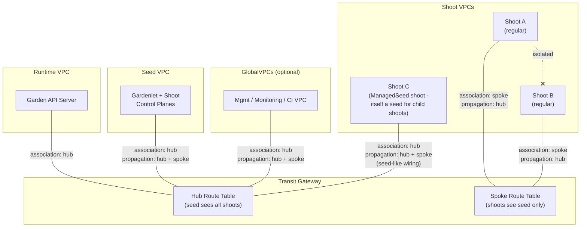

**How it works:**

- The seed VPC attachment is **associated** with the hub RT and its routes **propagate** to both hub and spoke RTs. This means all attached VPCs can see the seed.
- Each regular shoot VPC attachment is **associated** with the spoke RT and its routes **propagate** to the hub RT only. This means the seed can see all shoots, but shoots cannot see each other.
- GlobalVPC attachments (for management, monitoring, CI/CD VPCs) follow the same pattern as the seed: associated with hub, propagated to both.
- The runtime VPC (if enabled) is associated with the hub RT.
- **ManagedSeed shoots are special.** A shoot that is itself a Seed (i.e. `Shoot.spec.seedName` matches the seed of a child Seed object) gets seed-like wiring: associated with the **hub** RT, propagated to **both** hub and spoke. Without this, child shoots on the spoke RT would have no route back to the ManagedSeed's VPC — its workers host their control planes. This branch is enforced by `c.isManagedSeedShoot` in `ensureTransitGatewayAttachment`.

### Shared Mode

Shared mode uses a single route table where all attachments can see all other attachments. This creates a full mesh network.

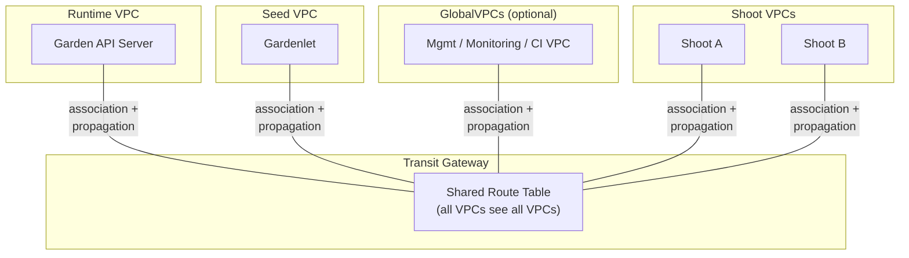

**How it works:**

- All VPC attachments — runtime, seed, globalVPC, and every shoot — are associated with and propagate to the same shared route table.
- Every VPC can route to every other VPC. Shoot-to-shoot traffic still traverses the TGW (Shoot A → TGW → shared RT lookup → TGW → Shoot B); there is no direct VPC peering.
- Peer-shoot CIDR routes are injected into each shoot's VPC route tables (`reconcile.go:1990`) so that workers actually steer cross-shoot traffic to the TGW instead of the default route.
- This is simpler to reason about but provides no shoot-to-shoot isolation.

> [!NOTE]
> **Cross-RT propagation in nested-seed scenarios.** When a ManagedSeed shoot itself runs in shared mode while its parent seed runs in hub-spoke, the parent's seed VPC may sit on the parent's hub or spoke RT. To keep return-traffic working in that nested scenario, child shoot attachments in shared mode also propagate to the hub and spoke RTs (`reconcile.go:2875-2878`) — not just the shared RT. This is invisible in the steady-state shared-mode picture above; it only matters when shared mode is layered on top of hub-spoke.

## Data Flow

Understanding how packets traverse the TGW fabric is essential for troubleshooting connectivity issues. The following diagrams show the actual routing path for traffic between the seed control plane and shoot worker nodes, and between shoots in shared mode.

### Seed to Shoot

When a control plane component on the seed (e.g., kube-apiserver) needs to reach a shoot's worker nodes, the packet follows this path through the TGW. The seed VPC has a static route for the shoot's VPC CIDR pointing at the TGW (injected by `ensureTGWRoutesInZones` on the seed shoot's reconcile). The TGW forwards the packet based on its route table, which contains propagated routes from each shoot's VPC attachment.

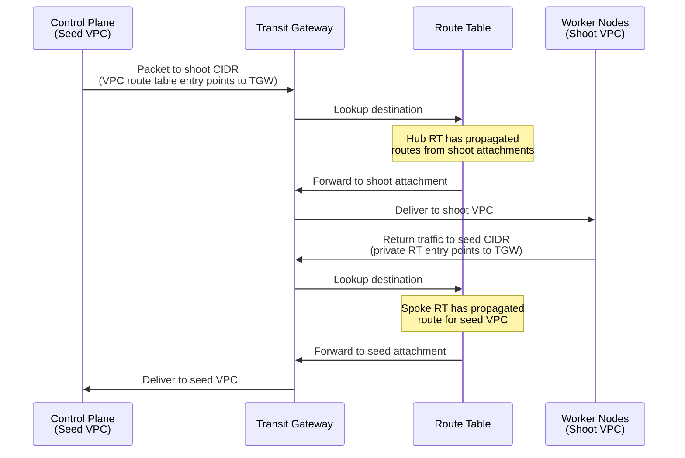

Return traffic works because the shoot VPC's private route tables also have TGW routes for the seed nodes CIDR (and optionally globalVPC CIDRs). These routes are injected by `ensureTGWRoutesInZones` during the shoot's own Infrastructure reconcile.

#### Variant: Child Shoot ↔ ManagedSeed Shoot

When the seed is itself the worker pool of a parent seed (a *ManagedSeed shoot*), the seed-side traffic flow uses different route tables than the regular case above. The ManagedSeed shoot's attachment sits on the **hub** RT (not spoke), and it propagates to both hub and spoke. This asymmetry is what lets child shoots reach the ManagedSeed VPC at all in hub-spoke mode.

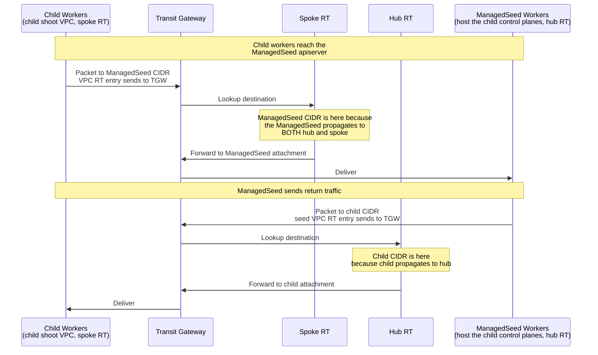

The two key code paths that produce this flow are `reconcile.go:2903-2906` (ManagedSeed shoot propagates to spoke RT in addition to hub) and the regular-shoot propagation to hub at `reconcile.go:2896`. Without the spoke-propagation branch, the child's spoke RT lookup would have no route to the ManagedSeed VPC and child workers would lose connectivity to their own control plane.

### Shoot to Shoot (Shared Mode)

In shared mode, all VPC attachments are associated with and propagate to the same route table. This means every VPC can see every other VPC's CIDR, enabling direct shoot-to-shoot communication.

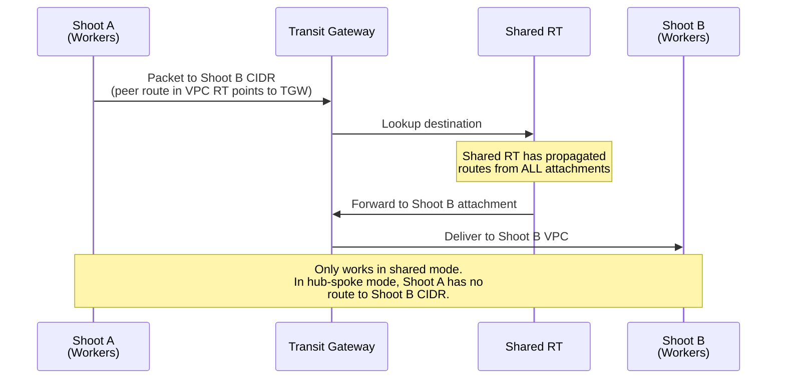

In hub-spoke mode, this path is impossible because shoot attachments are associated with the spoke RT, which only contains propagated routes for the seed VPC and globalVPCs. The spoke RT has no routes to other shoot VPCs, enforcing network isolation between shoots.

## Reconcile Flow

During each Infrastructure reconciliation, the TGW tasks execute in a dependency-ordered flow. Task names below are the strings exposed to operators in `lastOperation.description`. The diagram below shows **only the TGW-specific tasks** in the larger Infrastructure-reconcile DAG — non-TGW tasks like `ensure VPC`, `ensure zones resources`, `ensure default security group`, etc. (defined alongside these in `reconcile.go`) are omitted for clarity. Edges shown are the `Dependencies(...)` declarations for each `c.AddTask(g, ...)` call in `reconcile.go` lines 470-540.

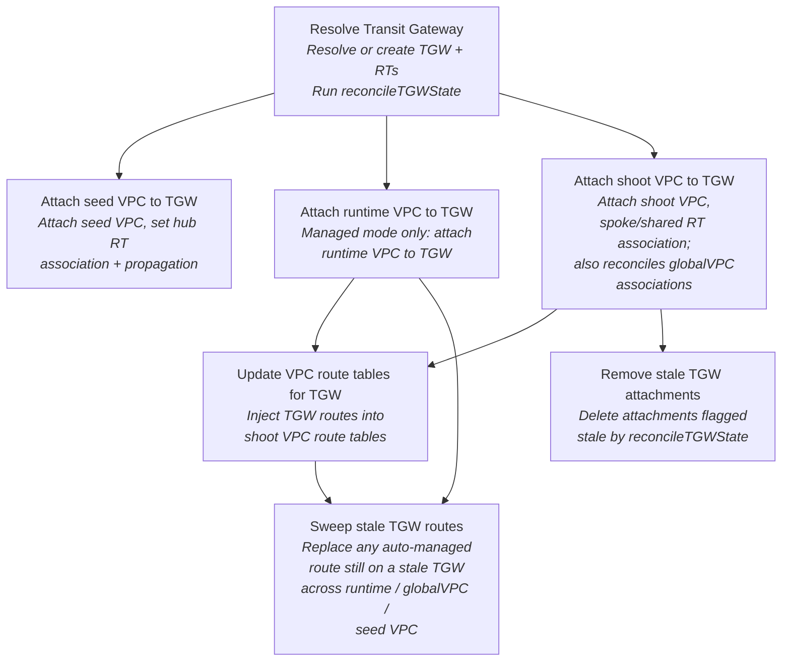

**Task details:**

| Task | Description |
|------|-------------|
| `Resolve Transit Gateway` | Resolves the TGW by ID (referenced) or creates it (managed). Creates or resolves route tables. Runs `reconcileTGWState` to detect and handle stale state from previous configurations. |
| `Attach seed VPC to TGW` | Attaches the seed VPC to the TGW (if `attachSeedVpc` is true). Associates the attachment with the hub RT (hub-spoke) or shared RT (shared). Enables propagation to hub+spoke (hub-spoke) or shared (shared). |
| `Attach runtime VPC to TGW` | In managed mode with `runtimeVPC.enabled`, auto-discovers the runtime cluster's VPC and attaches it to the TGW with hub RT association. |
| `Attach shoot VPC to TGW` | Attaches the shoot VPC to the TGW. Associates with the spoke RT (hub-spoke) or shared RT (shared). Enables propagation to the hub RT. For ManagedSeed shoots, uses hub RT instead of spoke and preserves spoke RT propagation so child shoots can reach the seed. As a side effect, this task also reconciles globalVPC attachments and their associations/propagations (using each globalVPC's `credentialsRef` for cross-account cases). |
| `Update VPC route tables for TGW` | Injects static routes into each availability zone's route table within the shoot VPC. Routes point at the TGW and cover: seed nodes CIDR, service CIDR, globalVPC CIDRs, and custom routes. Replaces stale/blackhole routes in place. |
| `Sweep stale TGW routes` | Invariant-based stale-TGW route sweep across runtime VPC, every globalVPC, and the seed VPC. Replaces any auto-managed CIDR still pointing at a previous TGW with the current one (Tier 1 active stale, narrow-CIDR scope) and any blackhole route whose abandoned TGW can be proven as previously ours (Tier 2 ownership-gated). See [Self-Healing](#self-healing). |
| `Remove stale TGW attachments` | Deletes attachments that were flagged as stale by `reconcileTGWState` during the same reconcile pass. Deferred to run after the new attachment is successfully created, avoiding connectivity gaps. |

> [!NOTE]
> The seed VPC attachment, runtime VPC attachment, and globalVPC attachments all run after `ensureTransitGateway` but before the shoot VPC attachment. This ordering ensures the TGW routing fabric is fully established before the shoot is connected.

### ManagedSeed Shoot Handling

When a shoot is also a ManagedSeed (detected by checking if a Seed object with the shoot's name exists via the garden API), `ensureTransitGatewayAttachment` adjusts its behavior:

| Behavior | Regular Shoot | ManagedSeed Shoot |
|----------|--------------|-------------------|
| RT association | Spoke RT (hub-spoke) or shared RT | **Hub RT** — the seed is the hub, must see all child shoots |
| Spoke RT propagation | Disabled (prevents cross-shoot traffic) | **Enabled** — child shoots on spoke need routes to the seed VPC |
| Hub RT propagation | Enabled (seed sees this shoot) | Enabled (same) |

This distinction is critical because the ManagedSeed shoot's VPC serves dual roles: it is both a shoot VPC (managed by its parent seed) and the seed VPC for its own child shoots. Without hub RT association, the seed cannot see child shoot VPC routes. Without spoke RT propagation, child shoots cannot route return traffic back to the seed.

> [!IMPORTANT]
> If `ensureTransitGatewayAttachment` cannot detect the ManagedSeed (e.g., the garden API is unreachable), it falls back to regular shoot behavior (spoke RT). This may cause connectivity issues for child shoots. Ensure `injectGardenKubeconfig: true` is set in the extension deployment to enable ManagedSeed detection.

## State Reconciliation (reconcileTGWState)

The `reconcileTGWState` function runs at the beginning of every TGW-enabled reconcile, inside `ensureTransitGateway`. It detects and corrects drift between the desired configuration and the actual AWS state. This is the primary mechanism for handling mode switches, TGW replacements, and orphaned resources.

The following diagram shows the full phase flow of `reconcileTGWState`. Each phase addresses a specific category of drift, and phases execute sequentially within a single reconcile pass. If any phase detects drift, the function returns `true` to signal the caller that a requeue is needed to verify the fix.

```mermaid
stateDiagram-v2
    [*] --> Phase0
    Phase0 : Phase 0 &#8211; Detect TGW ID Change
    Phase0 --> Phase1 : changed (reset all stale state)
    Phase0 --> Phase1 : unchanged
    Phase1 : Phase 1 &#8211; Flag Stale Attachments<br/>(this shoot's VPC)
    Phase1 --> Phase1a
    Phase1a : Phase 1a &#8211; Cross&#8209;VPC Stale Flag<br/>(our attachments on any wrong TGW)
    Phase1a --> Phase1b
    Phase1b : Phase 1b &#8211; Delete Blackhole Routes<br/>(shoot VPC only)
    Phase1b --> Phase2
    Phase2 : Phase 2 &#8211; Clean Orphaned/Duplicate RTs
    Phase2 --> Phase4
    Phase4 : Phase 4 &#8211; Cleanup Orphaned Managed TGWs
    Phase4 --> [*]

    note right of Phase1a
        Phase 3 (cross-VPC stale-route sweep)
        runs as a separate DAG task
        ("Sweep stale TGW routes") after the
        new attachment is in place. See
        Self-Healing.
    end note
```

### Phase 0: TGW ID Change Detection

Compares the TGW ID in the Infrastructure status (from the last successful reconcile) with the currently resolved TGW ID. If they differ, all cached state (attachment IDs, RT IDs, association state) is reset. This forces a full re-discovery on the new TGW.

**Triggers:** Switching from managed to referenced mode (or vice versa), replacing a referenced TGW with a different one.

### Phase 1: Flag Stale Attachments

Scans all attachment IDs stored in the Infrastructure status. For each one, verifies it exists and belongs to the correct TGW. Attachments that are on the wrong TGW or in a terminal state (`deleting`, `deleted`, `failing`, `failed`) are flagged for deferred deletion.

**Why deferred:** Deleting the old attachment before creating the new one would cause a connectivity gap. Instead, stale attachments are cleaned up by `cleanupStaleAttachments` after the new attachment is successfully created.

### Phase 1a: Cross-VPC Stale Flag

Phase 1 only catches stale attachments for the **shoot's own** VPC. Phase 1a closes the gap when this shoot's reconcile previously created attachments for *other* VPCs (the seed VPC, the runtime VPC, or any managed globalVPC) and those attachments are now on an abandoned TGW.

The phase searches by cluster tag (`kubernetes.io/cluster/<this-shoot-namespace>`) for every attachment we own across **all** VPCs, then flags any whose `TransitGatewayId` does not match the current TGW. Without this phase, after a cross-TGW transition the seed VPC could remain attached to the old TGW long enough for connectivity to stall.

### Phase 1b: Delete Blackhole Routes

Scans the shoot VPC route tables for any routes pointing at the TGW that are in a `blackhole` state (the target attachment was deleted). Removes these routes so they can be recreated with the correct attachment in `Update VPC route tables for TGW`.

> [!IMPORTANT]
> **Scope limit:** this phase only deletes blackhole routes in the **shoot's own VPC**. Routes in the seed VPC, runtime VPC, and globalVPCs are intentionally left untouched here, even when blackholed.
>
> Those route tables are maintained by *other* reconciles — the seed shoot's, each other child shoot's. Deleting a blackhole route in someone else's RT from this reconcile doesn't restore the correct route; only the canonical reconcile for that CIDR can. Between the delete and the next canonical reconcile, the destination is unreachable. The cross-VPC case is handled instead by the `Sweep stale TGW routes` task, which uses atomic `ReplaceRoute` to swap the target — no observable connectivity gap.

### Phase 2: Clean Orphaned Route Tables

For managed TGWs only. Lists all route tables on the managed TGW and identifies duplicates or orphans (route tables not referenced in the current configuration). Deletes orphaned RTs to prevent accumulation after isolation mode switches.

### Phase 3: Cross-VPC Route Sweep (separate DAG task)

Phase 3 used to run inline in `reconcileTGWState` but was moved to its own DAG task — `Sweep stale TGW routes` — so it runs **after** the new shoot attachment has been created. This avoids the original ordering hazard where a route was rewritten to point at a TGW the shoot wasn't yet attached to.

The task scans the runtime VPC, every globalVPC, and the seed VPC for auto-managed routes still pointing at a stale TGW and atomically replaces them with routes to the current TGW. The full algorithm — including the ownership-proof gate that protects user-defined routes from being touched — is documented under [Self-Healing → Stale-TGW Route Sweep with Ownership Proof](#stale-tgw-route-sweep-with-ownership-proof).

### Phase 4: Cleanup Orphaned Managed TGWs

Runs on every reconcile (not just during mode switches). Searches for managed TGWs that were created by this seed but are no longer referenced. Before deleting, checks that no other shoot attachments exist on the TGW (child-count guard). This prevents accidental deletion of a TGW that still has active shoots.

> [!IMPORTANT]
> Phase 4 is safe to run repeatedly. The child-count guard ensures a managed TGW is only deleted when it has zero remaining shoot VPC attachments. If any shoots are still attached, the cleanup is skipped and retried on the next reconcile.

## Self-Healing

The TGW integration uses an in-place retry pattern to recover from transient AWS inconsistencies without requiring a full reconcile cycle through the gardenlet's backoff queue.

The following state diagram shows the full lifecycle of a TGW VPC attachment, from initial lookup through creation and verification. The self-healing retry loop (max 1 retry per reconcile pass) handles stale state from previous configurations, eventual consistency delays, and terminal attachments without returning an error to the gardenlet.

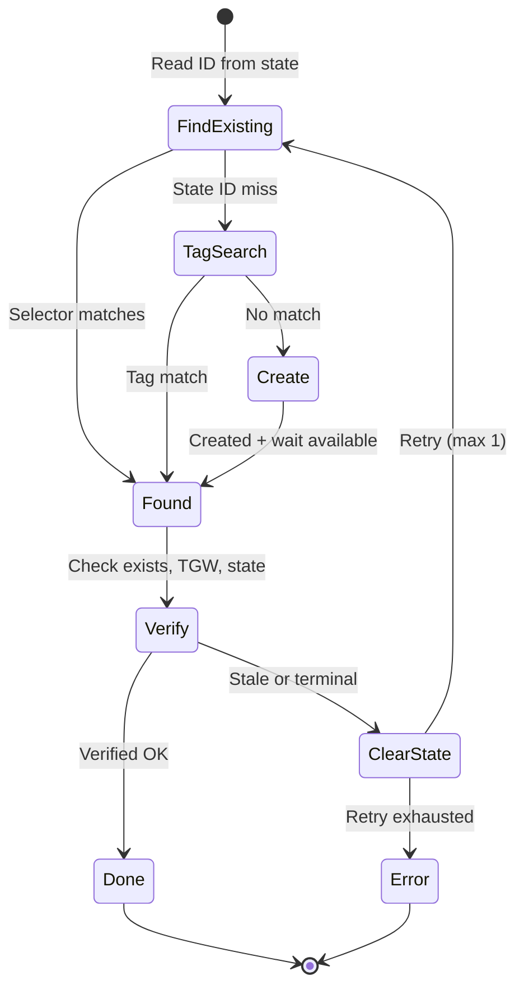

The `FindExisting` step uses a two-tier lookup: first by the attachment ID stored in the Infrastructure status (fast path), then by Kubernetes cluster tags if the stored ID misses (handles state loss or ID drift). The selector function rejects attachments that are on the wrong TGW or in a terminal state (`deleting`, `deleted`, `failing`, `failed`), ensuring that stale state from a previous TGW configuration is never reused.

> [!NOTE]
> **Seed VPC variant.** `ensureSeedVPCAttachment` (`reconcile.go:3120-3245`) prepends a primary search by VPC+TGW *before* falling through to `FindExisting`. The seed VPC has a known fixed identity per seed, so the cheapest possible lookup is to enumerate live attachments on the configured TGW and match by VPC ID. Only if that primary search misses does the function fall back to the state-ID + tag-search pattern shown above.

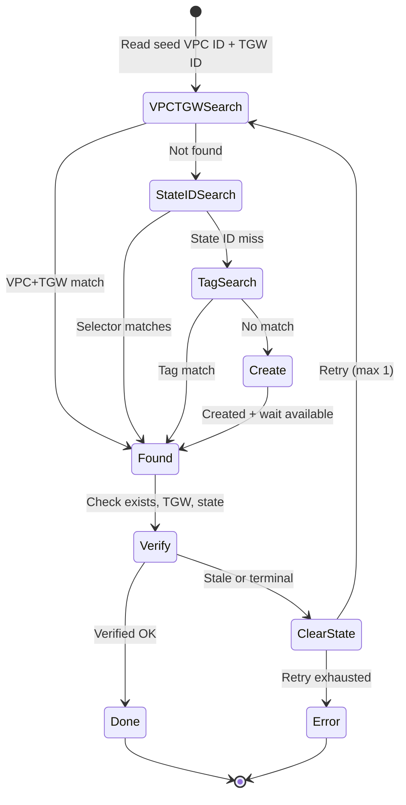

The following sequence diagram illustrates a concrete self-heal scenario where the stored attachment ID points to an attachment that is no longer valid for the current configuration. The extension detects the mismatch, creates a new attachment on the correct TGW, and updates state — all within a single reconcile pass.

This pattern handles any divergence between local state and AWS reality, including:

- A managed↔referenced TGW switch (stored attachment is on the old TGW)
- A new referenced TGW ID (stored attachment is on the previous TGW)
- An attachment deleted out-of-band (operator action, another extension, or AWS service event)
- Local state lost or restored from a stale backup
- An attachment found in a terminal state (`deleting`, `failing`, etc.)

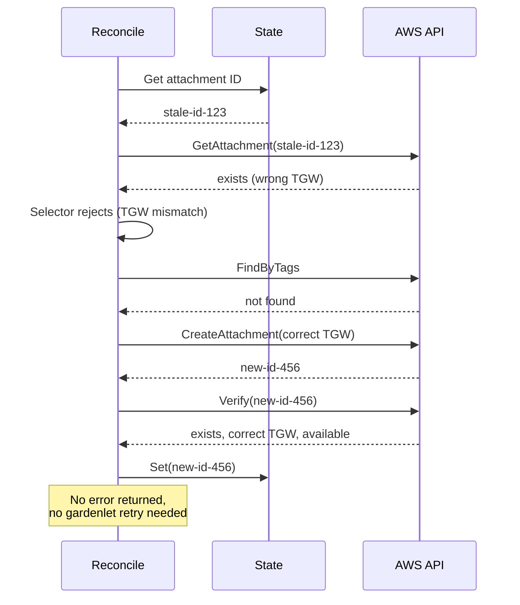

### Attachment Verification

Every time an attachment is looked up or created, a verification step runs immediately after:

1. **Exists check**: The attachment ID resolves to an actual AWS resource
2. **State check**: The attachment is not in a terminal state (`deleting`, `deleted`, `failing`, `failed`)
3. **TGW check**: The attachment belongs to the currently configured TGW (not a leftover from a previous configuration)

If any check fails, the cached state is cleared and the operation retries once within the same reconcile pass. This avoids a full error-return and gardenlet backoff cycle for issues that are immediately recoverable.

### Route Table State Verification

The same pattern applies to route table lookups. When resolving an RT by ID, the extension verifies the RT belongs to the correct TGW. If it belongs to a different TGW (stale state from a mode switch), the cached RT ID is cleared and re-resolved.

### Retry Limits

A maximum of 2 attempts (1 original + 1 retry) are made per operation per reconcile pass. If both attempts fail, an error is returned. This indicates something fundamentally wrong (e.g., IAM permissions revoked, TGW deleted out of band) rather than a transient inconsistency.

### Stale-TGW Route Sweep with Ownership Proof

Cross-TGW transitions (managed↔referenced, or replacing one referenced TGW with another) leave routes pointing at the previous TGW in route tables that this reconcile does not own — runtime VPC, globalVPCs, the seed VPC. The `Sweep stale TGW routes` task fixes these without ever touching a user's custom route. It scans private route tables in two tiers:

| Tier | Match | Action gate |
|------|-------|-------------|
| **1. Active stale** (`state=active`, target ≠ current TGW) | Replace only when the destination CIDR is in the auto-managed set: this shoot's VPC CIDR, the seed nodes CIDR, peer-shoot CIDRs (shared mode), and effective globalVPC CIDRs. | Narrow CIDR scope keeps the sweep from mutating user-defined routes that happen to target a non-Gardener TGW. |
| **2. Blackhole** (`state=blackhole`, target ≠ current TGW) | Replace when ownership of the abandoned TGW is provable. CIDR scope is **not** required — capturing this case is the whole point. | Three-step ownership proof, described below. |

The blackhole tier widens the CIDR scope on purpose: it must clean up cross-shoot CIDRs whose owning shoot has not yet migrated to the new TGW (the seed shoot's narrow CIDR set wouldn't include them yet). To stay safe in that wider scope, the sweep replaces a blackhole only when it can prove the abandoned TGW was previously managed by this extension.

**Ownership proof (`isAbandonedTGWOurs`):**

1. **State history.** Every TGW ID this reconcile has ever resolved is recorded in `IdentifierPreviousTGWs`. A hit means we know the TGW was ours, even if it has since been deleted from AWS.
2. **Per-reconcile cache.** Result is memoised so multiple blackhole routes pointing at the same abandoned TGW only cost one `DescribeTransitGateway` call.
3. **Live cluster-tag check.** `DescribeTransitGateway` looks at the abandoned TGW's tags. A `kubernetes.io/cluster/<this-shoot-namespace>=1` tag proves it was ours.

The third step distinguishes definitive answers from transient AWS errors:

| AWS response | Interpretation | Sweep behavior |
|---|---|---|
| `InvalidTransitGatewayID.NotFound` | Definitively gone — ownership unprovable. | Skip this entry. Emit `TGWBlackholeUnverifiable` (Warning). |
| Throttle, `ServiceUnavailable`, network error | Transient — could not check. | Skip this entry, set `tgwDriftDetected=true` so the reconcile completion gate requeues. Emit `TGWBlackholeTransient` (Warning). |
| Tag matches | Ours. | Replace, record to history, persist. |
| Tag does not match | Not ours. | Skip, emit `TGWBlackholeUnverifiable`. |

A per-reconcile cap (`maxSweepReplacesPerReconcile = 20`) bounds blast radius. If a regression ever pushed the sweep into a replace loop, the cap fires, the sweep aborts for the rest of that reconcile, and `TGWSweepCapReached` (Warning) surfaces it for operator review.

> [!NOTE]
> The self-healing mechanism is designed to handle the "eventually consistent" nature of AWS APIs, where a recently created resource may not be immediately visible in subsequent Describe calls. It is not a substitute for correct IAM permissions or valid TGW configuration.

## Concurrency, Drift & Multi-Tenant Safety

The TGW integration runs in environments where multiple Infrastructure reconciles may execute concurrently against shared TGW resources, where shoots routinely transition through Failed states (DWD cascades, manual recovery, network partitions), and where the AWS account may be shared with other teams managing their own TGW attachments. This section documents the mechanisms that keep behavior correct under those conditions.

### Canonical-Owner Pattern

Several TGW resources are *shared* — every shoot on the seed sees the same managed TGW, the same hub/spoke RTs, and the same seed VPC attachment. Concurrent reconciles all observe the same shared state, so a clear ownership rule is required to avoid two reconciles fighting over the same association.

The rule: **the seed shoot's own reconcile is the canonical owner of all shared TGW resources for that seed**. Every reconcile uses the helper `c.isManagedSeedShoot` (true when the current shoot is itself a Seed in the garden) plus `seedShootNS` (the seed shoot's namespace, derived deterministically from the shoot config or via convention fallback `shoot--<project>--<seedName>`) to decide whether it may *modify* a shared resource:

| Action | Canonical owner (seed shoot reconcile) | Other shoots |
|---|---|---|
| Create the managed TGW (managed mode) | YES | YES — first arrival wins; subsequent shoots discover-and-reuse |
| Create the hub/spoke/shared RTs | YES | YES — same first-arrival semantics |
| Associate the seed VPC attachment with hub/shared RT | **YES — exclusive** | NO — observe + flag drift only |
| Associate the runtime VPC attachment with hub RT | **YES — exclusive** | NO |
| Associate a managed globalVPC attachment with hub RT | **YES — exclusive** | NO |
| Associate this shoot's own VPC attachment with spoke/shared RT | YES (seed shoot uses hub) | YES |
| Tag a shared attachment with the *seed shoot's* cluster identifier | **YES — exclusive** (`seedCanonicalTags`) | NO — fix #1 |

Resources tagged via `seedCanonicalTags(suffix)` carry `kubernetes.io/cluster/<seedShootNS>=1`, not the calling shoot's namespace. This is what lets cleanup and discovery code (Phase 1a, ghost-prune, healthcheck topology check) recognize "ours" across reconciles. The `retagToSeedCanonical` helper actively re-tags any legacy attachments still carrying a child shoot's namespace tag.

### Topology Invariant

`assertSeedSideAssociations` (in `tgw_topology_invariant.go`) runs at the end of every TGW-enabled reconcile and asserts that every seed-side attachment is on the route table that matches the current isolation mode (hub-spoke ↔ shared). If it observes drift, it always emits the `TGWAssociationDrift` event and increments `tgw_association_drift_total`; only the canonical-owner reconcile attempts a corrective move.

```mermaid
sequenceDiagram
    participant Inv as Topology Invariant<br/>(every reconcile)
    participant CO as Canonical Owner<br/>(seed shoot only)
    participant AWS as AWS API
    Inv->>AWS: GetTransitGatewayAttachmentAssociation
    AWS-->>Inv: currentRT
    Inv->>Inv: derive expectedRT from isolation mode
    alt currentRT == expectedRT
        Inv->>Inv: healthy &#8211; return
    else drift detected
        Inv->>Inv: emit TGWAssociationDrift<br/>increment metric
        alt canonical owner reconcile
            CO->>AWS: EnableTransitGatewayRouteTablePropagation(expectedRT)
            CO->>AWS: DisassociateTransitGatewayRouteTable(currentRT)
            CO->>AWS: AssociateTransitGatewayRouteTable(expectedRT)
            CO->>CO: emit TGWAssociationDriftCorrected
        else non-owner reconcile
            Inv->>Inv: set tgwDriftDetected = true<br/>(reconcile completion gate requeues)
        end
    end
```

The corrective move uses the safe pre-propagate → disassociate → associate sequence so traffic continues to flow during the swap. Each step tolerates AWS "already done" error codes (`TransitGatewayRouteTablePropagation.Duplicate`, `Resource.NotAssociated`, etc.) so the move is idempotent across retries.

The drift-injection regression suite under `gardener-work/scripts/scenario-*.sh` exercises this path end-to-end:

| Script | Injection | Expected recovery |
|---|---|---|
| `scenario-association-drift-test.sh` | seed VPC attachment moved HUB → SHARED | topology invariant moves it back, ~120s |
| `scenario-child-attachment-drift-test.sh` | child VPC attachment moved SPOKE → HUB | child shoot's own Phase 1/Phase 2 switch moves it back, ~150s |
| `scenario-child-attachment-delete-test.sh` | child VPC attachment hard-deleted | child shoot reconcile detects stale state, recreates + re-associates, ~180s |

### Failed-State Recovery (cluster_unfailed_watcher)

When a shoot transitions into the `Failed` state, gardenlet's `ShootNotFailedPredicate` filters out subsequent events for that shoot — preventing the Infrastructure controller from re-reconciling even after the underlying problem clears. Without intervention, the shoot stays Failed until manual annotation.

The `cluster_unfailed_watcher` (in `pkg/controller/infrastructure/cluster_unfailed_watcher.go`) watches `Cluster` CRs and detects the `Failed → non-Failed` transition on the embedded shoot. When it fires, it enqueues the matching Infrastructure resource so the reconciler picks up where it left off. This is the recovery path for the post-S6 transient Failure observed during the audit (fix #105).

### Pre-emptive Route Table Dedup

Concurrent reconciles racing to create the hub or spoke RT for a managed TGW occasionally produce duplicates: each reconcile checks "does the RT exist?", both observe "no", both call `CreateTransitGatewayRouteTable`. AWS returns success to both; the cluster ends up with two hub RTs (or two spoke RTs) on the same TGW, only one of which has the canonical associations.

`cleanDuplicateManagedRouteTables` (called at the start of every `ensureTransitGateway` for managed TGWs — fix #107) lists the RTs by tag, identifies any duplicates of `*-tgw-rt-hub` / `*-tgw-rt-spoke` / `*-tgw-rt-shared`, and deletes the unassociated ones. Pre-emptive — no reconcile should ever attempt to associate against a duplicate.

### Transient AWS Error Handling (SDK Retryer)

AWS TGW operations exhibit eventual-consistency on resource references: a TGW attachment that just returned `Available` from `Describe` may yield `InvalidTransitGatewayAttachmentID.NotFound` from a subsequent `Disassociate`/`Associate` call seconds later. Hand-rolled per-call-site retries proliferated and were inconsistent.

Fix #111 installs an EC2 service retryer (`withTGWTransientRetryer` in `pkg/aws/client/client.go`) at the SDK level. It extends the standard retryer with a small allowlist of transient codes:

- `InvalidTransitGatewayID.NotFound`
- `InvalidTransitGatewayAttachmentID.NotFound`
- `InvalidTransitGatewayRouteTableID.NotFound`
- `IncorrectState`

The retryer caps at 5 attempts with 30s max backoff, which fully covers the AWS eventual-consistency window while still surfacing genuine errors. All TGW SDK calls inherit this behavior — no per-call-site changes required.

### State Hygiene: PreviousTGWs Ghost Prune

The `IdentifierPreviousTGWs` state child accumulates every TGW ID this reconcile has ever seen. It is consulted by `isAbandonedTGWOurs` to short-circuit the cluster-tag check during stale-route sweeps (a hit means "we've owned this before, the route is safe to replace").

Over time the entry count grows unbounded. Worse, after a TGW is deleted from AWS, its entry stays in state forever — turning into a *ghost* that can never again be verified live. Fix #112 adds `pruneGhostTGWHistory`: at the end of every reconcile, it iterates the history and drops any entry whose TGW returns `InvalidTransitGatewayID.NotFound` AND is not currently active. Live `Describe` errors that are *transient* (throttle, network) preserve the entry so a flaky AWS API never causes data loss.

In practice, the first reconcile after a long-lived seed deploys the upgraded extension typically prunes 10-20 ghost entries; subsequent reconciles converge to a small, accurate set.

### Multi-Tenant AWS Account Safety

The TGW integration may run in an AWS account shared with other teams who manage their own TGW attachments on the same VPCs. For example, an environment may co-host an unrelated team's Transit Gateway that attaches to several shoot VPCs the extension manages.

`MigrateTGW` (called when a shoot is migrated between seeds) and `reconcileTGWDeleteState` (called during shoot deletion) both call `FindTransitGatewayVPCAttachments(ctx, "", vpcID)` to enumerate attachments on the shoot's VPC. Without filtering, both code paths would iterate **all** attachments — including foreign teams' — and call `DeleteTransitGatewayVPCAttachment` on each.

Fix #114 filters the result by the calling shoot's cluster tag (`c.tagKeyCluster()` / `TagValueCluster`) before deletion. Attachments that do not carry our tag are skipped and logged. The check matches the safe pattern already used at the top of `cleanupStaleAttachments` — fix #114 brings the migration and delete paths in line with it.

> [!IMPORTANT]
> If your environment hosts multiple teams' TGW attachments on the same VPC, ensure your team's attachments are consistently tagged with `kubernetes.io/cluster/<shoot-namespace>=1` (the standard Gardener cluster tag) so the safety filter recognizes them as ours.

## Mode Switching

The extension supports all twelve directed transitions among the four `(mode, isolation)` configurations: `{Referenced, Managed} × {Hub-Spoke, Shared}`. These transitions are handled automatically by `reconcileTGWState` during the next Infrastructure reconcile after the seed configuration is updated.

Transitions that change the TGW ID (managed↔referenced) trigger a Phase 0 full state reset; transitions that only change the isolation mode on the same TGW reuse the existing attachment and only change the route-table association. The diagram below labels each transition by class:

```mermaid
stateDiagram-v2
    RefHub : Referenced Hub&#8209;Spoke
    RefShared : Referenced Shared
    MgdHub : Managed Hub&#8209;Spoke
    MgdShared : Managed Shared

    %% Same TGW, isolation switch only (4)
    MgdHub --> MgdShared : isolation only
    MgdShared --> MgdHub : isolation only
    RefHub --> RefShared : isolation only
    RefShared --> RefHub : isolation only

    %% TGW change, same isolation (4)
    MgdHub --> RefHub : TGW only
    RefHub --> MgdHub : TGW only
    MgdShared --> RefShared : TGW only
    RefShared --> MgdShared : TGW only

    %% TGW + isolation change (4)
    MgdHub --> RefShared : TGW + isolation
    RefShared --> MgdHub : TGW + isolation
    MgdShared --> RefHub : TGW + isolation
    RefHub --> MgdShared : TGW + isolation
```

Transitions between managed and referenced modes always involve a TGW ID change because managed mode auto-creates a new TGW while referenced mode uses a pre-provisioned one. The Phase 0 reset ensures no stale state from the old TGW leaks into the new configuration.

### Supported Transitions

All twelve directed transitions are supported. They fall into three classes by what the reconciler must do:

**Same TGW, isolation switch only — 4 transitions.** No TGW ID change, so no Phase 0 reset. Phase 2 cleans up the now-orphaned RTs (e.g. the old shared RT after switching to hub-spoke). All attachments re-associate to the RT for the new isolation mode within a single reconcile pass.

| From | To |
|------|----|
| Managed / Hub-Spoke | Managed / Shared |
| Managed / Shared | Managed / Hub-Spoke |
| Referenced / Hub-Spoke | Referenced / Shared |
| Referenced / Shared | Referenced / Hub-Spoke |

**TGW change only, same isolation — 4 transitions.** Phase 0 detects the TGW ID change and resets all cached state. Phase 1 + Phase 1a flag every attachment we own on the abandoned TGW. New attachments are created on the target TGW with the same isolation pattern, and stale attachments on the old TGW are deleted after the new ones are confirmed available. For managed→referenced, Phase 4 eventually deletes the abandoned managed TGW once it has no remaining attachments.

| From | To |
|------|----|
| Managed / Hub-Spoke | Referenced / Hub-Spoke |
| Referenced / Hub-Spoke | Managed / Hub-Spoke |
| Managed / Shared | Referenced / Shared |
| Referenced / Shared | Managed / Shared |

**TGW + isolation change — 4 transitions.** Combines both classes above. Phase 0 reset + new attachments on target TGW with the new isolation mode's RT associations. The most complex class because the new TGW must also have the right RTs created/discovered in Phase 1 of the current reconcile before attachments can be associated.

| From | To |
|------|----|
| Managed / Hub-Spoke | Referenced / Shared |
| Referenced / Shared | Managed / Hub-Spoke |
| Managed / Shared | Referenced / Hub-Spoke |
| Referenced / Hub-Spoke | Managed / Shared |

### How Mode Switching Works

1. The operator updates the seed's `SeedProviderConfig.transitGateway` section.
2. The `seed_tgw_watcher` controller detects the Seed configuration change.
3. The watcher annotates all Infrastructure resources on that seed with `gardener.cloud/operation=reconcile`, triggering an immediate reconcile for every shoot.
4. Each Infrastructure reconcile runs `reconcileTGWState`, which:
   - Detects the TGW ID change (Phase 0) and/or isolation mode change
   - Flags stale attachments on the old TGW for this VPC (Phase 1) and across all VPCs we own (Phase 1a)
   - Deletes blackhole routes in the shoot VPC (Phase 1b)
   - Cleans orphaned/duplicate RTs on managed TGWs (Phase 2)
   - Cleans up orphaned managed TGWs (Phase 4)
5. Subsequent DAG tasks then create new attachments, inject routes, sweep cross-VPC stale routes (the former Phase 3, now `Sweep stale TGW routes`), and clean up stale attachments after the new ones are ready.

The `seed_tgw_watcher` controller is the entry point for all mode switches. It watches the Seed object for TGW configuration changes using a `reflect.DeepEqual` comparison of the old and new `transitGateway` config. When a change is detected, it enqueues all AWS Infrastructure resources for reconciliation and, if the TGW ID changed, pre-wires the seed VPC attachment on the new TGW to prevent gardenlet connectivity loss.

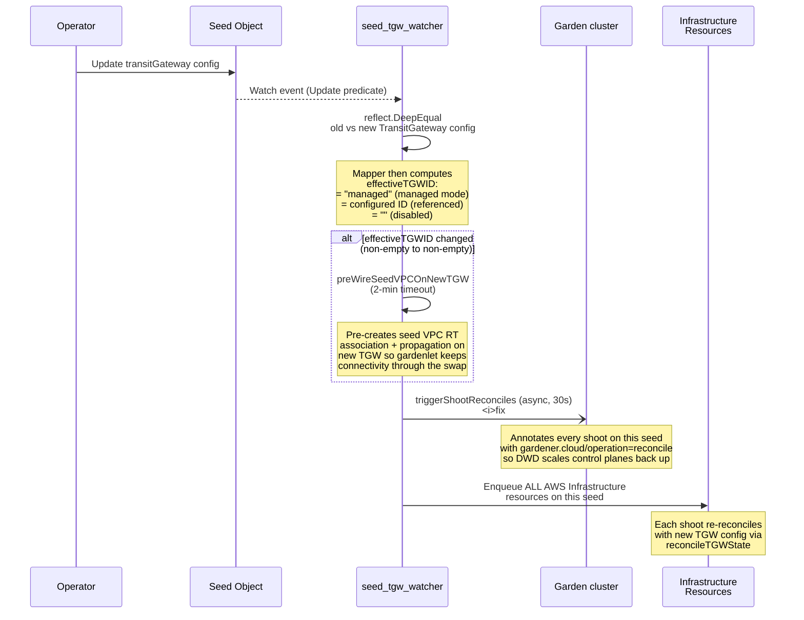

**When pre-wiring runs.** The watcher caches the last-seen *effective TGW ID* per Seed (the configured ID for referenced mode, or the literal string `"managed"` for managed mode). Pre-wiring fires whenever the previous and new effective IDs are both non-empty and differ — i.e., on any cross-TGW transition: managed↔referenced, or replacing one referenced TGW with another. It is skipped for first-time enablement (old empty) or full disable (new empty), since those cases have no chicken-and-egg.

The pre-wiring step is critical for managed seeds. Without it, a TGW ID change would leave the seed VPC without a route to the Garden API server, causing the gardenlet to lose connectivity and preventing it from processing the very reconcile that would fix the routing. The watcher resolves this chicken-and-egg problem by establishing the seed VPC's attachment on the new TGW before any shoot reconciles run. Non-managed-seed clusters benefit too — pre-wiring shrinks the connectivity gap during a TGW swap regardless of whether the shoot is itself a seed.

> [!WARNING]
> Mode switches cause a brief connectivity disruption for each shoot while the old attachment is replaced with the new one. The extension minimizes this window by deferring stale attachment deletion until after the new attachment is created, but a gap of a few seconds is expected during the AWS API propagation delay.

## Cross-Account Setup

TGW integration supports cross-account configurations where the TGW, seed VPC, globalVPCs, or any combination reside in different AWS accounts from the seed.

### Authentication Modes

Every credential reference (`transitGatewayCredentialsRef`, `seedVPCCredentialsRef`, and `globalVPCs[].credentialsRef`) supports three authentication modes:

| Mode | Fields | Description |
|------|--------|-------------|
| 1. Secret only | `name` + `namespace` | Static access keys from a Kubernetes Secret. Used directly for API calls. |
| 2. AssumeRole only | `assumeRoleARN` | The shoot's own credentials call `sts:AssumeRole` to get temporary credentials in the target account. No additional Secret needed. |
| 3. Secret + AssumeRole | `name` + `namespace` + `assumeRoleARN` | Keys from the Secret call `sts:AssumeRole`. Supports intermediary accounts where the Secret's keys belong to Account A, which assumes a role in Account B. |

Mode 2 is **recommended for production** — temporary credentials (1-hour TTL, auto-refreshed), no long-lived keys in target accounts, full CloudTrail audit trail.

### TGW in a Different Account

```yaml
transitGateway:
  enabled: true
  id: "tgw-0abc123def456789"

  # Mode 1: Static keys in a Secret
  transitGatewayCredentialsRef:
    name: "tgw-owner-creds"
    namespace: "garden"

  # Mode 2: Shoot creds assume role (recommended)
  transitGatewayCredentialsRef:
    assumeRoleARN: "arn:aws:iam::111111111111:role/gardener-tgw-admin"
    externalID: "gardener-seed-prod-01"

  # Mode 3: Intermediary account keys assume role
  transitGatewayCredentialsRef:
    name: "networking-account-keys"
    namespace: "garden"
    assumeRoleARN: "arn:aws:iam::111111111111:role/gardener-tgw-admin"
    externalID: "gardener-seed-prod-01"
```

For Mode 1, the Secret must contain static AWS credentials:

```yaml
apiVersion: v1
kind: Secret
metadata:
  name: tgw-owner-creds
  namespace: garden
type: Opaque
data:
  accessKeyID: <base64-encoded>
  secretAccessKey: <base64-encoded>
```

### GlobalVPC in a Different Account

Each globalVPC entry can specify its own `credentialsRef` using any of the three modes:

```yaml
globalVPCs:
- name: "management"
  vpcId: "vpc-0ddd444eee555fff6"
  cidrs: ["10.50.0.0/16"]
  credentialsRef:
    assumeRoleARN: "arn:aws:iam::333333333333:role/gardener-mgmt-vpc"
```

### IAM Requirements

#### Caller-Side: `sts:AssumeRole` Permission

For Modes 2 and 3, the calling credentials need permission to assume the target role:

```json
{
  "Sid": "AllowAssumeRole",
  "Effect": "Allow",
  "Action": "sts:AssumeRole",
  "Resource": "arn:aws:iam::111111111111:role/gardener-tgw-admin"
}
```

#### Target-Side: Trust Policy

The IAM role in the target account must trust the calling account:

```json
{
  "Version": "2012-10-17",
  "Statement": [
    {
      "Effect": "Allow",
      "Principal": {
        "AWS": "arn:aws:iam::999999999999:root"
      },
      "Action": "sts:AssumeRole",
      "Condition": {
        "StringEquals": {
          "sts:ExternalId": "gardener-seed-prod-01"
        }
      }
    }
  ]
}
```

Replace `999999999999` with the calling account ID (shoot account for Mode 2, Secret's account for Mode 3). The `ExternalId` condition is optional but recommended — it prevents confused deputy attacks where another tenant sharing the calling account could trick the extension into assuming the role on their behalf.


#### Target-Side: Permissions

The target role must have the permissions listed in [Prerequisites](#prerequisites). For `transitGatewayCredentialsRef`, this means all TGW CRUD, route table, and association/propagation actions. For `seedVPCCredentialsRef`, VPC route table and attachment operations. For `globalVPCs[].credentialsRef`, VPC attachment and route operations for that specific VPC.

### Client Isolation

> [!IMPORTANT]
> The extension creates separate AWS clients per credential reference. Shoot VPC operations always use the shoot's own credentials. Only TGW-side operations use `transitGatewayCredentialsRef`. Only seed VPC operations use `seedVPCCredentialsRef`. Each globalVPC uses its own `credentialsRef`. This ensures least-privilege isolation — each client only has access to the resources it needs.

## CIDR Validation

The admission webhook validates that no CIDR ranges overlap within a TGW routing domain. Overlapping CIDRs would cause ambiguous routing and potential traffic misdirection.

### What Is Validated

The webhook checks for overlaps between all of the following CIDRs within the same TGW routing domain:

- **Shoot VPC CIDRs**: The `networks.vpc.cidr` of every shoot on the seed
- **Seed nodes CIDR**: The seed's `spec.networks.nodes` range
- **GlobalVPC CIDRs**: All `cidrs` entries from `globalVPCs`
- **Custom route CIDRs**: All `destinationCidrBlock` entries from `customRoutes`

### Validation Scope

Validation runs at two levels:

1. **Per-seed validation**: When a shoot is created or updated, its VPC CIDR is checked against all other shoots on the same seed, plus the seed's own CIDRs and globalVPC CIDRs.

2. **Cross-seed validation**: When a shoot migrates between seeds, the webhook validates the shoot's CIDRs against the destination seed's routing domain. This prevents a shoot from landing on a seed where its CIDR would conflict with an existing shoot.

### When Validation Runs

- On `Shoot` create and update (via admission webhook)
- On `Seed` configuration update (validates globalVPC and custom route CIDRs against existing shoots)
- During Infrastructure reconcile (runtime check for drift that bypassed admission)

> [!WARNING]
> The admission webhook can only validate CIDRs that are declared in the Gardener API objects. If VPC CIDRs are modified directly in AWS outside of Gardener, the webhook cannot detect the overlap. Always manage VPC CIDRs through Gardener shoot specifications.

## Health Monitoring

The extension reports TGW health through a dedicated shoot condition: `TGWNetworkHealthy`.

The `TGWHealthChecker` performs two categories of checks on each evaluation: attachment health and route health. When any check fails, it emits a detailed diagnostic message identifying the root cause and recommended action, then triggers an automatic Infrastructure reconcile on a Fibonacci backoff schedule.

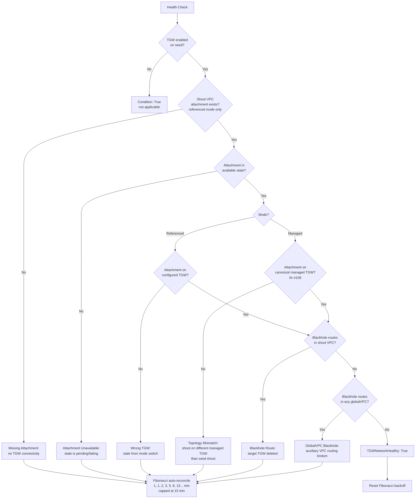

When a health check passes after a previous failure, the Fibonacci backoff counter is reset so the next failure starts again at the initial 1-minute interval. This prevents the backoff from accumulating across unrelated transient issues.

### Health Checks

The healthcheck operates on **VPC-scoped data only**: VPC attachments visible to the shoot's own credentials, and route tables in VPCs the shoot has access to. It does **not** call TGW-side APIs (`DescribeTransitGateway`, `SearchTransitGatewayRoutes`), so it does not require cross-account TGW credentials even when `transitGatewayCredentialsRef` is configured for the reconciler. TGW-side state correctness is enforced by the reconciler, not by the healthcheck.

The following checks are performed on each health evaluation:

| Check | Failure Condition |
|-------|-------------------|
| Shoot VPC attachment exists | No VPC attachment found for the shoot VPC (referenced mode only — see note below) |
| Shoot attachment state | A shoot VPC attachment is not in the `available` state |
| Shoot attachment on correct TGW (referenced mode) | A shoot-tagged attachment is on a TGW different from the configured one |
| Managed-mode topology mismatch (fix #106) | The shoot's tagged attachment is on a managed TGW that is **not** tagged with the seed shoot's cluster identifier — i.e. the shoot is on a different managed TGW than the seed |
| No blackhole routes (shoot VPC) | Blackhole routes pointing at any TGW exist in the shoot VPC's route tables |
| No blackhole routes (globalVPCs) | Blackhole routes pointing at any TGW exist in any configured globalVPC's route tables |

> [!NOTE]
> In **managed** mode the seed config does not carry a TGW ID — the reconciler creates the TGW dynamically. The simple "wrong TGW" check is therefore referenced-mode-only. Fix #106 closes that blind spot by computing the *canonical* managed TGW per reconcile (the one tagged with the seed shoot's namespace) and asserting that every shoot on the same seed shares it. Without this check, a partial mode switch (e.g. seed shoot moved to a new managed TGW but child shoots stuck on the old one) silently passed all per-shoot healthchecks.

### Condition Status

The `TGWNetworkHealthy` condition appears on the shoot's status:

```yaml
status:
  conditions:
  - type: TGWNetworkHealthy
    status: "True"
    reason: HealthCheckSuccessful
    message: "TGW healthy · referenced/hub-spoke · 5 attachment(s) · last reconciled 2m0s ago"
```

The True message includes the TGW mode, isolation mode, the number of attachments observed for the shoot's VPC, and (when available) how long ago the Infrastructure last reconciled.

> [!IMPORTANT]
> The healthcheck only ever returns `True` or `False`. It does **not** return `Progressing` for transient reconcile state — an earlier iteration tried that and Gardener's threshold-mapping framework flipped the condition to False after timeout, cascading to ExtensionsReady=False and a DWD scale-down on the seed shoot. The condition's status reflects observed network state, not reconcile activity.

When unhealthy:

```yaml
status:
  conditions:
  - type: TGWNetworkHealthy
    status: "False"
    reason: TGWAttachmentNotAvailable
    message: "Shoot VPC attachment tgw-attach-0aaa111 is in state 'failing'"
```

### Fibonacci Auto-Reconcile

When the TGW health check fails, the extension triggers automatic re-reconciliation on a Fibonacci schedule: 1, 1, 2, 3, 5, 8, 13, 21 minutes, and so on. This provides:

- **Fast initial recovery**: Two retries within the first minute for transient issues
- **Escalating backoff**: Progressively longer intervals to avoid hammering AWS APIs during prolonged outages
- **Automatic recovery**: Once the issue resolves (e.g., a pending attachment becomes available), the next reconcile succeeds and resets the Fibonacci counter

## Observability

The extension emits Kubernetes Events on the Infrastructure resource for all significant TGW operations. These events are visible via `kubectl describe infrastructure <name>` or `kubectl get events`.

### Events Reference

| Event | Type | Description |
|-------|------|-------------|
| `TGWResolved` | Normal | TGW ID successfully resolved (referenced mode lookup or managed mode discovery) |
| `TGWCreated` | Normal | A new managed TGW was auto-created |
| `TGWReconciled` | Normal | Full TGW reconcile completed successfully |
| `TGWAttachmentCreating` | Normal | Creating a new VPC attachment to the TGW |
| `TGWAttachmentCreated` | Normal | VPC attachment successfully created and available |
| `TGWAttachmentDeleted` | Normal | A stale or orphaned attachment was cleaned up |
| `TGWIsolationSwitch` | Normal | Isolation mode change detected (e.g., hub-spoke to shared) |
| `TGWModeSwitch` | Warning | TGW ID changed, indicating a referenced-to-managed or managed-to-referenced switch |
| `TGWStaleAttachment` | Warning | An attachment on the wrong TGW was flagged for deferred deletion |
| `TGWBlackholeRoute` | Warning | A blackhole route was found and deleted from a shoot VPC route table |
| `TGWStaleRoute` | Warning | A stale route (pointing at old TGW or wrong attachment) was replaced |
| `TGWOrphanedCleanup` | Warning | An orphaned managed TGW is being deleted (no remaining attachments) |
| `TGWCIDROverlap` | Warning | A CIDR overlap was detected during reconcile-time validation |
| `TGWDisabling` | Warning | TGW is being disabled on the seed; all attachments and routes will be removed |
| `TGWDeleting` | Warning | TGW resources (attachments, routes) are being deleted for this shoot |
| `TGWMigrating` | Normal | Shoot migration detected; TGW attachments and routes being cleaned up on source seed |
| `TGWBlackholeReplaced` | Warning | The invariant sweep replaced a blackhole route whose abandoned TGW was provably ours |
| `TGWBlackholeUnverifiable` | Warning | A blackhole route was skipped because the abandoned TGW could not be proven as previously ours — manual review recommended |
| `TGWBlackholeTransient` | Warning | A blackhole route's ownership check hit a transient AWS error; deferred to the next reconcile |
| `TGWSweepCapReached` | Warning | The sweep hit `maxSweepReplacesPerReconcile` in a single reconcile and aborted — investigate before re-running |
| `TGWReconcileRequeue` | Warning | The reconcile completion gate detected drift after the final sweep and is requeueing |
| `TGWSwitchDeadlock` | Warning | Phase 2 RT switch hit the ping-pong abandonment cap, indicating two writers are fighting for the same attachment |
| `TGWIsolationSwitchFailed` | Warning | An isolation-mode switch (hub-spoke ↔ shared) failed Phase 2 and will be retried |
| `TGWRouteCleanup` | Normal | A stale route that no longer matches any auto-managed CIDR was removed |
| `TGWAssociationDrift` | Warning | A seed VPC, runtime VPC, or managed globalVPC attachment is associated with a route table that does not match the current isolation mode (hub-spoke ↔ shared). Emitted by every reconcile that observes the drift; the seed shoot's reconcile actively corrects it. |
| `TGWAssociationDriftCorrected` | Normal | The seed-shoot reconcile completed the safe RT move (pre-propagate → disassociate → associate) for an attachment that was on the wrong route table. |

> [!NOTE]
> Warning-type events indicate situations that may require operator attention. Normal-type events are informational and indicate expected operations. All events include the relevant resource IDs (TGW ID, attachment ID, route table ID) in their message for troubleshooting.

### Prometheus Metrics

The extension exposes six TGW counters at the controller-runtime `/metrics` endpoint. They are additive — they do not change reconcile behavior, only operator visibility.

| Metric | Labels | Meaning |
|--------|--------|---------|
| `tgw_sweep_replacements_total` | `type={"active","blackhole"}` | Every `ReplaceRoute` made by the invariant sweep, partitioned by the route's state at the time of sweep. |
| `tgw_blackhole_unverifiable_total` | — | Blackhole routes the sweep skipped because the abandoned TGW could not be proven as ours (state history empty AND live cluster-tag check failed). |
| `tgw_reconcile_requeue_total` | — | Completion-gate triggers — drift remained after the final sweep, so reconcile returned an error to requeue. |
| `tgw_drift_detected_total` | `source={"phase0","phase1","phase1a","sweep_active","sweep_blackhole","transient"}` | Drift detections by source within a single reconcile. `phase0` = TGW ID change; `sweep_*` = sweep replacement; `transient` = transient AWS error during sweep. |
| `tgw_sweep_cap_reached_total` | — | Per-reconcile sweep cap was hit. Defensive signal — investigate for an unintended replace loop. |
| `tgw_association_drift_total` | `role={"seed","runtime","globalvpc"}` | Seed-side TGW attachment associations that did not match the configured isolation mode (hub-spoke ↔ shared). Non-zero rate means the canonical-owner contract is drifting; the seed shoot reconcile corrects it. |

**Operator queries:**

| PromQL | Tells you |
|--------|-----------|
| `rate(tgw_sweep_replacements_total{type="blackhole"}[5m])` | Cross-TGW transition activity rate |
| `tgw_blackhole_unverifiable_total > 0` | Manual review needed for un-ownable blackhole routes |
| `rate(tgw_reconcile_requeue_total[5m])` | Drift not converging in a single reconcile pass |
| `tgw_sweep_cap_reached_total > 0` | Sweep hit defensive cap — investigate before acting |
| `sum(rate(tgw_association_drift_total[5m])) by (role)` | Topology drift by attachment role — non-zero indicates a stale isolation-mode residue is being corrected; persistent non-zero indicates the correction isn't converging |

## Day-2 Operations

### Disabling TGW on a Seed

To disable TGW integration on a seed:

1. Set `transitGateway.enabled: false` in the seed's `SeedProviderConfig`.
2. The `seed_tgw_watcher` triggers reconciliation of all Infrastructure resources on the seed.
3. Each reconcile removes the shoot's TGW attachment, route table associations, propagations, and VPC routes.
4. After all shoots have reconciled, the managed TGW (if any) is cleaned up by Phase 4.

> [!WARNING]
> Disabling TGW removes all private routing between the seed and shoot VPCs. Ensure shoots can still communicate with the seed through alternative means (e.g., public endpoints, VPN) before disabling.

### Switching Isolation Modes

To switch between hub-spoke and shared isolation:

1. Update the `isolationMode` field in the seed's `SeedProviderConfig`.
2. If switching to hub-spoke with referenced RTs, also set `hubRouteTableId` and `spokeRouteTableId`.
3. If switching to shared with a referenced RT, set `routeTableId`.
4. The `seed_tgw_watcher` triggers reconciliation of all shoots.
5. Each shoot's reconcile re-associates its attachment with the correct route table.

### Adding or Removing GlobalVPCs

**Adding a globalVPC:**

1. Add the new entry to the `globalVPCs` list in the seed's `SeedProviderConfig`.
2. The next Infrastructure reconcile (for any shoot) will create the attachment and routes.
3. All subsequent shoot reconciles will inject the new globalVPC CIDRs into their route tables.

**Removing a globalVPC:**

1. Remove the entry from the `globalVPCs` list.
2. The next reconcile will stop injecting that globalVPC's CIDRs into shoot VPC route tables.
3. The attachment itself is cleaned up during reconcileTGWState.

### Migrating Shoots Between TGW-Enabled Seeds

When a shoot migrates from one seed to another (both TGW-enabled):

1. The source seed's Infrastructure reconcile detects the migration and emits a `TGWMigrating` event.
2. The source seed cleans up: deletes the shoot VPC attachment, removes route table associations, removes routes from the shoot VPC.
3. The destination seed's Infrastructure reconcile creates new: attachment to the destination TGW, route table associations, VPC routes.
4. The admission webhook validates CIDR compatibility with the destination seed before the migration is allowed.

> [!IMPORTANT]
> The shoot VPC must not have a CIDR that overlaps with any existing shoot on the destination seed. The admission webhook enforces this, but operators should verify CIDRs before initiating a migration.

### Troubleshooting

**Check TGW events on a shoot's Infrastructure resource:**

```bash
kubectl get events --field-selector involvedObject.name=my-shoot \
  -n shoot--my-project--my-shoot --sort-by='.lastTimestamp'
```

**Check the TGW attachment state in AWS:**

```bash
aws ec2 describe-transit-gateway-vpc-attachments \
  --filters "Name=transit-gateway-id,Values=tgw-0abc123def456789" \
  --query 'TransitGatewayVpcAttachments[*].{VPC:VpcId,State:State,AttachmentId:TransitGatewayAttachmentId}' \
  --output table --region ${AWS_REGION}
```

**Check routes in the TGW route tables:**

```bash
aws ec2 search-transit-gateway-routes \
  --transit-gateway-route-table-id tgw-rtb-0aaa111bbb222ccc3 \
  --filters "Name=state,Values=active,blackhole" \
  --region ${AWS_REGION}
```

**Check routes injected into a shoot VPC:**

```bash
aws ec2 describe-route-tables \
  --filters "Name=vpc-id,Values=vpc-0shoot123" \
  --query 'RouteTables[*].Routes[?TransitGatewayId!=`null`]' \
  --output table --region ${AWS_REGION}
```

**Common issues:**

| Symptom | Likely Cause | Resolution |
|---------|-------------|------------|
| `TGWNetworkHealthy: False` with "attachment not available" | Attachment stuck in `pending` or `failing` state | Check VPC subnet availability, IAM permissions, and TGW quotas |
| Blackhole routes in hub RT | Shoot VPC attachment was deleted but routes remain | Trigger a reconcile; the blackhole cleanup phase will remove stale routes |
| Shoot cannot reach seed after mode switch | Old routes in shoot VPC point at previous TGW | Trigger a reconcile; `ensureTGWRoutesInZones` will replace stale routes |
| Cross-account attachment fails | IAM trust policy misconfigured or credentials expired | Verify the trust policy and check the Secret referenced by `credentialsRef` |
| Phase 4 not cleaning orphaned TGW | Other shoots still attached to the old TGW | Wait for all shoots to reconcile and detach from the old TGW |
| CIDR overlap admission error | Two shoots on the same seed have overlapping VPC CIDRs | Resize one of the VPCs or move a shoot to a different seed |

## Glossary

| Term | Definition |
|------|------------|
| **TGW** | Transit Gateway. An AWS networking construct that acts as a regional hub for routing traffic between VPCs and on-premises networks. |
| **RT** | Route Table. A TGW route table that controls how traffic is routed between TGW attachments. |
| **Hub RT** | Hub Route Table. In hub-spoke mode, the route table associated with the seed, runtime, and globalVPC attachments. Contains routes to all attached VPCs. |
| **Spoke RT** | Spoke Route Table. In hub-spoke mode, the route table associated with shoot VPC attachments. Contains routes only to the seed and globalVPCs, not to other shoots. |
| **Shared RT** | Shared Route Table. In shared mode, the single route table associated with all attachments. All VPCs can reach all other VPCs. |
| **Referenced mode** | A configuration where the operator provides pre-existing TGW and route table IDs. The extension manages only attachments, associations, propagations, and VPC routes. |
| **Managed mode** | A configuration where the extension auto-creates the TGW and route tables. Set by omitting the `id` field. |
| **Hub-spoke isolation** | A network topology where the seed can reach all shoots, but shoots cannot reach each other. Achieved using separate hub and spoke route tables. |
| **Shared isolation** | A network topology where all attached VPCs can reach all other VPCs. Uses a single shared route table. (Note: "shared isolation" is a misnomer -- there is no isolation in this mode.) |
| **GlobalVPC** | An additional VPC (e.g., management, monitoring, CI/CD) attached to the TGW alongside the seed and shoots. Its CIDRs are routed into every shoot VPC. |
| **Runtime VPC** | The VPC hosting the Gardener runtime cluster (Garden API server). Auto-discovered when `runtimeVPC.enabled` is set. |
| **Seed VPC** | The VPC hosting the seed cluster where gardenlet and shoot control planes run. |
| **Shoot VPC** | The VPC created by Gardener for a shoot cluster's worker nodes. Each shoot has its own VPC. |
| **Attachment** | A TGW VPC Attachment. The AWS resource that connects a VPC to a Transit Gateway. Each VPC-to-TGW connection is a separate attachment. |
| **Association** | The binding of a TGW attachment to a specific route table. Each attachment can be associated with exactly one route table. The associated RT determines how traffic from that VPC is routed. |
| **Propagation** | The mechanism by which a VPC's CIDR routes are automatically added to a TGW route table. An attachment can propagate its routes to multiple route tables. |
| **DWD** | Dependency Watchdog. A Gardener component that monitors a shoot's apiserver reachability from the seed and scales control-plane workloads (KCM, MCM, CA) down or up depending on connectivity. A TGW outage that disconnects the seed from the shoot apiserver triggers a DWD scale-down — making restoring TGW connectivity time-sensitive. |
| **Blackhole route** | A route in a TGW route table whose target attachment no longer exists or is in a terminal state. Traffic matching a blackhole route is silently dropped. |
| **ManagedSeed shoot** | A shoot that is itself a Seed (its own VPC hosts child shoots' control planes). Detected by the extension via `c.isManagedSeedShoot`. ManagedSeed shoots get seed-like TGW wiring: hub-RT association and propagation to both hub + spoke. |
| **Canonical owner** | The reconcile that has exclusive write authority over a shared TGW resource (e.g. seed VPC attachment associations). For shared resources, the seed shoot's reconcile is the canonical owner; child-shoot reconciles only read and flag drift. See [Concurrency, Drift & Multi-Tenant Safety](#concurrency-drift--multi-tenant-safety). |
| **Topology invariant** | A defensive assertion run at the end of every reconcile (`assertSeedSideAssociations`) that verifies seed-side attachments are on the route table matching the current isolation mode. On drift, every reconcile emits a `TGWAssociationDrift` event; only the canonical owner corrects. |
